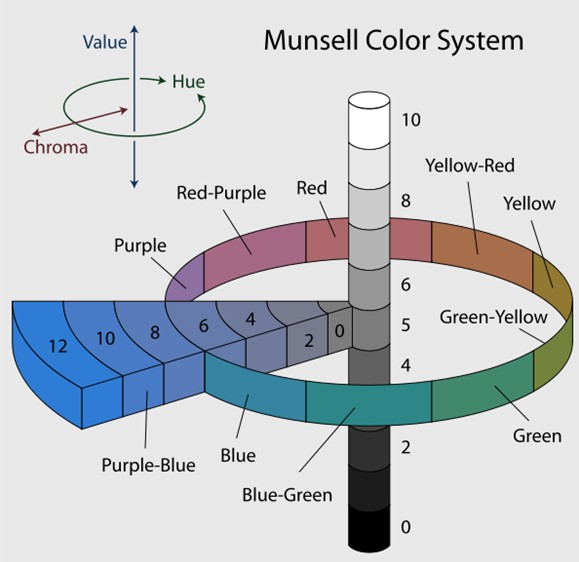

# Optical Flow 光流
## 概念
从本质上说，光流就是你在这个运动着的世界里感觉到的明显的视觉运动

当你坐在火车上，然后往窗外看。你可以看到树、地面、建筑等等，他们都在往后退。这个运动就是光流。而且，我们都会发现，他们的运动速度居然不一样？这就给我们提供了一个挺有意思的信息：通过不同目标的运动速度判断它们与我们的距离。一些比较远的目标，例如云、山，它们移动很慢，感觉就像静止一样。但一些离得比较近的物体，例如建筑和树，就比较快的往后退，然后离我们的距离越近，它们往后退的速度越快。一些非常近的物体，例如路面的标记啊，草地啊等等，快到好像在我们耳旁发出嗖嗖的声音。

光流除了提供远近外，还可以提供角度信息。与咱们的眼睛正对着的方向成90度方向运动的物体速度要比其他角度的快，当小到0度的时候，也就是物体朝着我们的方向直接撞过来，我们就是感受不到它的运动（光流）了，看起来好像是静止的。当它离我们越近，就越来越大（当然了，我们平时看到感觉还是有速度的，因为物体较大，它的边缘还是和我们人眼具有大于0的角度的）。

Gibson(1950)：光流是空间运动物体在观察成像平面上的像素运动的瞬时速度，是利用图像序列中像素在时间域上的变化以及相邻帧之间的相关性来找到上一帧跟当前帧之间存在的对应关系，从而计算出相邻帧之间物体的运动信息的一种方法。

当人的眼睛观察运动物体时，物体的景象在人眼的视网膜上形成一系列连续变化的图像，这一系列连续变化的信息不断“流过”视网膜（即图像平面），好像一种光的“流”，故称之为光流（optical flow）。

## 研究目的
研究光流场的目的就是为了从图片序列中近似得到不能直接得到的运动场。运动场，其实就是物体在三维真实世界中的运动；光流场，是运动场在二维图像平面上（人的眼睛或者摄像头）的投影。

## 计算
那通俗的讲就是通过一个图片序列，把每张图像中每个像素的运动速度和运动方向找出来就是光流场。那怎么找呢？咱们直观理解肯定是：第t帧的时候A点的位置是(x1, y1)，那么我们在第t+1帧的时候再找到A点，假如它的位置是(x2,y2)，那么我们就可以确定A点的运动了：(ux, vy) = (x2, y2) - (x1,y1)。

计算方法：基于梯度的方法、基于匹配的方法、基于能量的方法、基于相位的方法。近年来神经动力学方法也颇受学者重视。

OpenCV中实现了不少的光流算法。

1）calcOpticalFlowPyrLK

通过金字塔Lucas-Kanade 光流方法计算某些点集的光流（稀疏光流）。理解的话，可以参考这篇论文：”Pyramidal Implementation of the Lucas Kanade Feature TrackerDescription of the algorithm”

2）calcOpticalFlowFarneback

用Gunnar Farneback 的算法计算稠密光流（即图像上所有像素点的光流都计算出来）。它的相关论文是："Two-Frame Motion Estimation Based on PolynomialExpansion"

3）CalcOpticalFlowBM

通过块匹配的方法来计算光流。

4）CalcOpticalFlowHS

用Horn-Schunck 的算法计算稠密光流。相关论文好像是这篇：”Determining Optical Flow”

5）calcOpticalFlowSF

这一个是2012年欧洲视觉会议的一篇文章的实现："SimpleFlow: A Non-iterative, Sublinear Optical FlowAlgorithm"，工程网站是：http://graphics.berkeley.edu/papers/Tao-SAN-2012-05/  在OpenCV新版本中有引入。

稠密光流需要使用某种插值方法在比较容易跟踪的像素之间进行插值以解决那些运动不明确的像素，所以它的计算开销是相当大的。

而对于稀疏光流来说，在他计算时需要在被跟踪之前指定一组点（容易跟踪的点，例如角点），因此在使用LK方法之前我们需要配合使用cvGoodFeatureToTrack()来寻找角点，然后利用金字塔LK光流算法，对运动进行跟踪。但个人感觉，对于少纹理的目标，例如人手，LK稀疏光流就比较容易跟丢。

IJCV2011有一篇文章，《A Database and Evaluation Methodology for Optical Flow》里面对主流的光流算法做了简要的介绍和对不同算法进行了评估。

光流场是图片中每个像素都有一个x方向和y方向的位移，所以在上面那些光流计算结束后得到的光流flow是个和原来图像大小相等的双通道图像。那怎么可视化呢？这篇文章用的是Munsell颜色系统来显示。

## 孟赛尔颜色系统（Munsell Color System）

孟塞尔颜色系统的空间大致成一个圆柱形：

南北轴=明度（value），从全黑（1）到全白（10）。

经度=色相（hue）。把一周均分成五种主色调和五种中间色：红(R)、红黄(YR)、黄(Y)、黄绿(GY)、绿(G)、绿蓝(BG)、蓝(B)、蓝紫(PB)、紫(P)、紫红(RP)。相邻的两个位置之间再均分10份，共100份。

距轴的距离=色度（chroma），表示色调的纯度。其数值从中间（0）向外随着色调的纯度增加，没有理论上的上限（普通的颜色实际上限为10左右，反光、荧光等材料可高达30）。由于人眼对各种颜色的的敏感度不同，色度不一定与每个色调和明度组合相匹配。

具体颜色的标识形式为：色相+明度+色度。

https://blog.csdn.net/zouxy09/article/details/8683859
