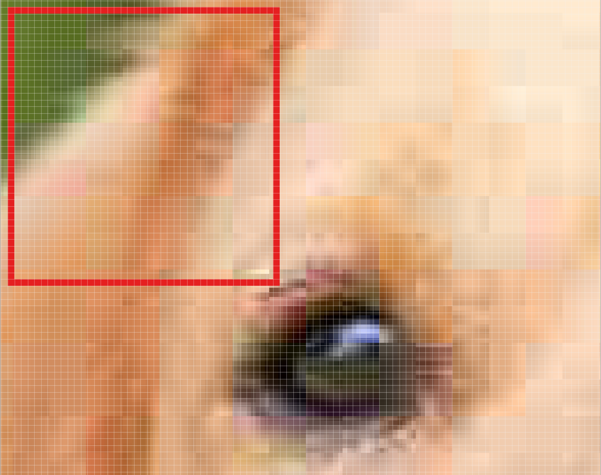
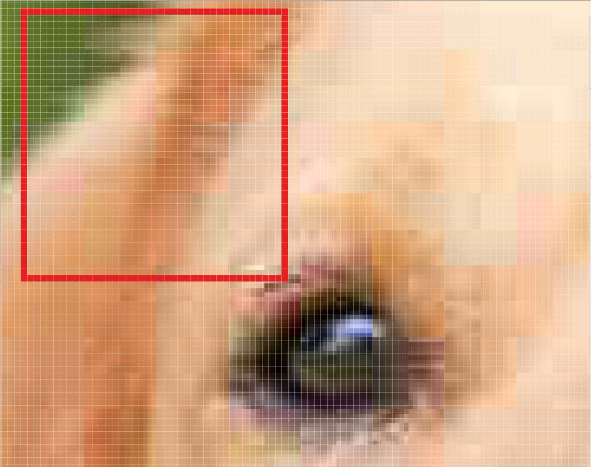

# CNN中的filter

### 分解一张图片
CNN 的第一步是把图片分成小块。我们通过选取一个给定宽度和高度的滤波器来实现这一步。

滤波器会照在图片的小块 patch （图像区块）上。这些 patch 的大小与滤波器一样大。

如之前视频所示，CNN用滤波器来把图片分割成更小的 patch，patch 的大小跟滤波器大小相同。

我们可以在水平方向，或者竖直方向滑动滤波器对图片的不同部分进行聚焦。

滤波器滑动的间隔被称作 stride（步长）。这是你可以调节的一个超参数。增大 stride 值后，会减少每层总 patch 数量，因此也减小了模型大小。通常这也会降低图像精度。
让我们看一个例子，在这个放大的狗图片中，我们从红框开始，我们滤波器的高和宽决定了这个正方形的大小

然后我们向右把方块移动一个给定的步长（这里是2），得到另一块 patch。

我们把方块向右移动两个像素，得到另一个 patch。

这里最重要的是我们把相邻的像素聚在一起，把他们视作一个集合。
在普通非卷积的神经网络中，我们忽略了这种临近性。在普通网络中，我们把输入图片中的每一个像素与下一层的神经元相连。图片中相邻像素在一起是有原因的，并且有着特殊意义，但普通网络没有有效利用好这些信息。
要利用这种临近结构，我们的 CNN 就要学习如何分类临近模式，例如图片中的形状和物体。

### 过滤器深度 Filter Depth
通常每个卷积层都会有多余一个filter(滤波器)，不同滤波器提取一个patch的不同特性，例如一个滤波器寻找颜色，另一个寻找指定物体的形状，卷积层滤波器的数量为滤波器的深度。

每个 patch 连接多少神经元？

这取决于滤波器的深度，如果深度是 k，我们把每个 patch 与下一层的 k 个神经元相连。这样下一层的高度就是 k，如下图所示。实际操作中，k是一个我们可以调节的超参数，大多数的 CNNs 倾向于选择相同的起始值。

滤波器的深度为k，与下一层的k个神经元相连

为什么我们把一个 patch 与下一层的多个神经元相连呢？一个神经元不够好吗？
多个神经元的作用在于，一个 patch 可以有多个有意义的，可供提取的特点。
例如，一个 patch 可能包括白牙，金色的须，红舌头的一部分。在这种情况下，我们需要一个深度至少为3的滤波器，一个识别牙，一个识别须，一个识别舌头。

记住，CNN 并没有被规定寻找特定特征。与之相反，它自我学习什么特征值得注意。

https://blog.csdn.net/sinat_32547403/article/details/74898083
