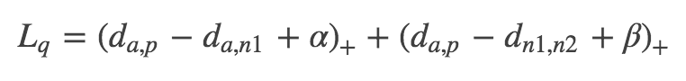

# Quadruplet Loss

属于一种度量学习的损失函数

Triplet loss 是一种非常常用的度量学习方法，而 Quadruplet loss 和 TriHard loss 是它的两个改进版本。Quadruplet loss 相对于 Triplet loss 考虑了正负样本对之间的绝对距离，而 TriHard loss 则是引入了 hard sample mining 的思想，MSML 则吸收了这两个优点。

度量学习的目标是学习一个函数，使得空间上语义相似度反映在RD空间的距离上，类似于PDA的降维作用。

通常我们需要定义一个距离度量函数

来表示嵌入空间（Embedding space）的距离，而这个距离也用来重识别行人图片。

在国内外研究现状里面介绍的三元组损失、四元组损失和 TriHard 损失都是典型度量学习方法。给定一个三元组 {a,p,n}，三元组损失表示为：

三元组损失只考虑了正负样本对之间的相对距离。为了引入正负样本对之间的绝对距离，四元组损失加入一张负样本组成了四元组 {a,p,n1,n2}，而四元组损失也定义为：

假如我们忽视参数 α 和 β 的影响，我们可以用一种更加通用的形式表示四元组损失：

其中 m 和 n 是一对负样本对，m 和 a 既可以是一对正样本对也可以是一对负样本对。
但是直接使用 Lq′ 并不能取得很好的结果，因为随着数据量的上升，可能四元组组合数量急剧上升。绝大部分样本对都是比较简单的，这限制了模型的性能。
