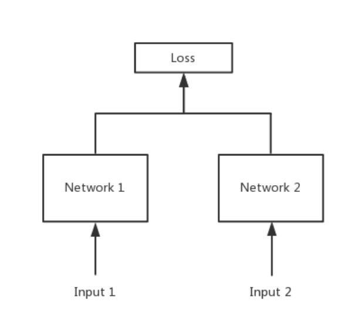

# Siamese Network孪生神经网路

## 1. 简介
简单来说，Siamese network就是“连体的神经网络”，神经网络的“连体”是通过共享权值来实现的，如下图所示。

大家可能会有疑问：共享权值是什么意思？左右两个神经网络的权重一模一样？

答：是的，在代码实现的时候，甚至可以是同一个网络，不用实现另外一个，因为权值都一样。对于siamese network，两边可以是lstm或者cnn，都可以。

大家可能还有疑问：如果左右两边不共享权值，而是两个不同的神经网络，叫什么呢？

答：pseudo-siamese network，伪孪生神经网络，如下图所示。对于pseudo-siamese network，两边可以是不同的神经网络（如一个是lstm，一个是cnn），也可以是相同类型的神经网络。

## 2. 孪生神经网络的用途是什么？

简单来说，衡量两个输入的相似程度。孪生神经网络有两个输入（Input1 and Input2）,将两个输入feed进入两个神经网络（Network1 and Network2），这两个神经网络分别将输入映射到新的空间，形成输入在新的空间中的表示。通过Loss的计算，评价两个输入的相似度。

随着SVM等算法的兴起，neural network被人们遗忘，还好有一些执着的人们，坚守在了神经网络研究的阵地。2010年Hinton在ICML上发表了文章《Rectified Linear Units Improve Restricted Boltzmann Machines》，用来做人脸验证，效果很好。其原理很简单，将两个人脸feed进卷积神经网络，输出same or different。

## 3. 孪生神经网络和伪孪生神经网络分别适用于什么场景呢？

先上结论：孪生神经网络用于处理两个输入"比较类似"的情况。伪孪生神经网络适用于处理两个输入"有一定差别"的情况。比如，我们要计算两个句子或者词汇的语义相似度，使用siamese network比较适合；如果验证标题与正文的描述是否一致（标题和正文长度差别很大），或者文字是否描述了一幅图片（一个是图片，一个是文字），就应该使用pseudo-siamese network。也就是说，要根据具体的应用，判断应该使用哪一种结构，哪一种Loss。

## 4. Siamese network loss function一般用哪一种呢？

Softmax当然是一种好的选择，但不一定是最优选择，即使是在分类问题中。传统的siamese network使用Contrastive Loss。损失函数还有更多的选择，siamese network的初衷是计算两个输入的相似度,。左右两个神经网络分别将输入转换成一个"向量"，在新的空间中，通过判断cosine距离就能得到相似度了。Cosine是一个选择，exp function也是一种选择，欧式距离什么的都可以，训练的目标是让两个相似的输入距离尽可能的小，两个不同类别的输入距离尽可能的大。其他的距离度量没有太多经验，这里简单说一下cosine和exp在NLP中的区别。

根据实验分析，cosine更适用于词汇级别的语义相似度度量，而exp更适用于句子级别、段落级别的文本相似性度量。其中的原因可能是cosine仅仅计算两个向量的夹角，exp还能够保存两个向量的长度信息，而句子蕴含更多的信息（当然，没有做实验验证这个事情）。

我们在论文里使用了exp距离做多分类，解决Fakenewschallenge上标题与正文立场是否一致的衡量问题。

## 5. Siamese network是双胞胎连体，整一个三胞胎连体行不行？

不好意思，已经有人整过了，叫Triplet network，论文是《Deep metric learning using Triplet network》，输入是三个，一个正例+两个负例，或者一个负例+两个正例，训练的目标是让相同类别间的距离尽可能的小，让不同类别间的距离尽可能的大。Triplet在cifar, mnist的数据集上，效果都是很不错的，超过了siamese network。

## 6. Siamese network的用途有哪些？

这个可以说太多了，nlp&cv领域都有很多应用。

前面提到的词汇的语义相似度分析，QA中question和answer的匹配，签名/人脸验证。

手写体识别也可以用siamese network，网上已有github代码。

还有kaggle上Quora的question pair的比赛，即判断两个提问是不是同一问题，冠军队伍用的就是n多特征+Siamese network，知乎团队也可以拿这个模型去把玩一下。

在图像上，基于Siamese网络的视觉跟踪算法也已经成为热点《Fully-convolutional siamese networks for object tracking》。

https://www.jianshu.com/p/92d7f6eaacf5
