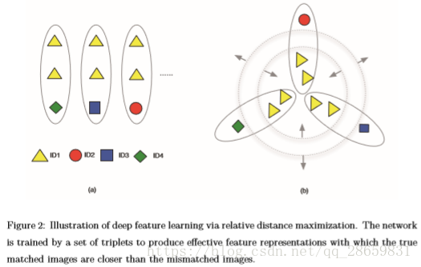
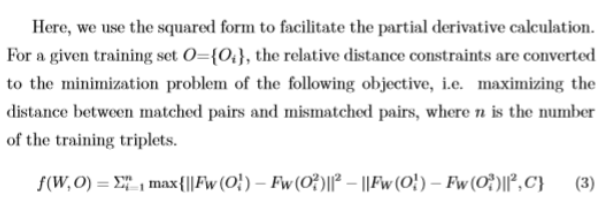

# Triplet Loss

> Triplet Loss是深度学习中的一种损失函数，用于训练差异性较小的样本，如人脸等
> Feed数据包括锚（Anchor）示例、正（Positive）示例、负（Negative）示例，
> 通过优化锚示例与正示例的距离小于锚示例与负示例的距离，实现样本的相似性计算。

Triplet Loss的核心是锚示例、正示例、负示例共享模型，通过模型，将锚示例与正示例聚类，远离负示例。

- 输入：三个输入，即锚示例、正示例、负示例，不同示例的结构相同；
- 模型：一个共享模型，支持替换为任意网络结构；
- 输出：一个输出，即三个模型输出的拼接。

## 计算公式
Triplet Loss损失函数的计算公式如下：

## 思想精髓
Triplet Loss的思想精髓如下图所示，通过选择三张图片构成一个三元组，即Anchor、Negative、Positive，通过Triplet Loss的学习后使得Positive元和Anchor元之间的距离最小，而和Negative之间距离最大。其中Anchor为训练数据集中随机选取的一个样本，Positive为和Anchor属于同一类的样本，而Negative则为和Anchor不同类的样本。

## 适用问题
一般Triplet Loss使用场景是在ReID问题

ReID问题使用Triplet Loss原因：

（1）Triplet Loss可以非常好地解决类间相似、类内差异的问题，即不同ID的图片内容上很相似，而相同ID的图片又因为光照、场景变化、人体姿态多样化的原因导致内容差异很大。

（2）Person ReID的问题图片数据集很小，通过构造三元组可以生成远多于图片数量的triplets，因此训练的时候可以加入更多的限制，可以有效地缓解过拟合。

其中Fw是将网络等效成一个参数为W的函数映射，O是训练及图片，O^1和O^2是同ID的图片，O^1和O^3是不同ID的图片。C的作用防止简单的triplets造成loss太小，给一个下界。

https://www.jianshu.com/p/2cbd823257a6

https://blog.csdn.net/qq_28659831/article/details/80805291
