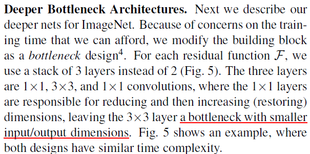
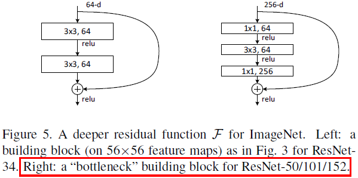
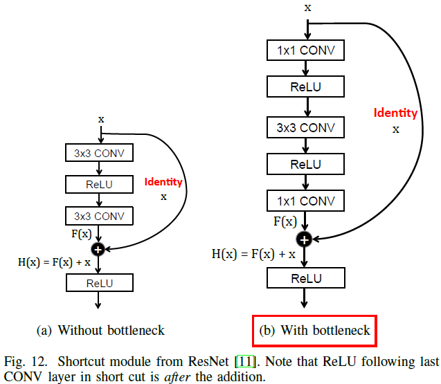

# bottleneck layer
对于Bottleneck Layer 或 Bottleneck  Features ，亦或 Bottleneck Block，意思就是输入输出维度差距较大，就像一个瓶颈一样，上窄下宽亦或上宽下窄

对Bottleneck Building Block的表述："In order to reduce the number of weights, 1x1 filters are applied as a "bottleneck" to reduce the number of channels for each filter",在这句话中，1x1 filters 最初的出处即"Network In Network"，1x1 filters 可以起到一个改变输出维数（channels）的作用（elevation or dimensionality reduction）。下面来看一下ResNet对Bottleneck Building Block的表述：

Bottleneck features are generated from a multi-layer perceptron in which one of the internal layers has a small number of hidden units, relative to the size of the other layers.

一篇论文 "Improved Bottleneck Features Using Pretrained Deep Neural Networks" :
https://www.semanticscholar.org/paper/Improved-Bottleneck-Features-Using-Pretrained-Deep-Yu-Seltzer/de8d30f9c59be0c235ae2de7da77993e54f9f91f

参考：https://blog.csdn.net/u011501388/article/details/80389164
