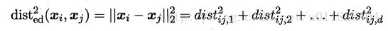

# metric learning 度量学习

> 度量学习（Metric Learning）也就是常说的相似度学习。
> 如果需要计算两张图片之间的相似度，如何度量图片之间的相似度使得不同类别的图片相似度小而相同类别的图片相似度大
>（maximize the inter-class variations and minimize the intra-class variations）就是度量学习的目标

例如如果我们的目标是识别人脸，那么就需要构建一个距离函数去强化合适的特征（如发色，脸型等）；而如果我们的目标是识别姿势，那么就需要构建一个捕获姿势相似度的距离函数。为了处理各种各样的特征相似度，我们可以在特定的任务通过选择合适的特征并手动构建距离函数。然而这种方法会需要很大的人工投入，也可能对数据的改变非常不鲁棒。度量学习作为一个理想的替代，可以根据不同的任务来自主学习出针对某个特定任务的度量距离函数。

首先要学习出距离度量必须先定义一个合适的距离度量形式。对两个样本xi与xj，它们之间的平方欧式距离为：

https://blog.csdn.net/u012938704/article/details/52672869

https://blog.csdn.net/u011826404/article/details/72123031

https://blog.csdn.net/suan2014/article/details/78297982
