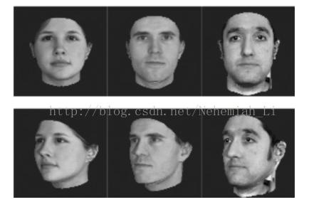
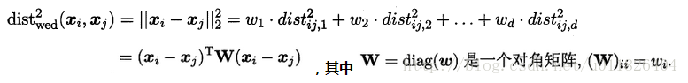
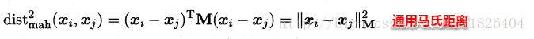
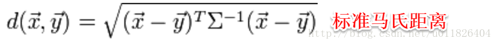

# metric learning 度量学习

> 度量学习（Metric Learning）也就是常说的相似度学习。
> 如果需要计算两张图片之间的相似度，如何度量图片之间的相似度使得不同类别的图片相似度小而相同类别的图片相似度大
>（maximize the inter-class variations and minimize the intra-class variations）就是度量学习的目标

### 为什么要用度量学习？
很多的算法越来越依赖于在输入空间给定的好的度量。例如K-means、K近邻方法、SVM等算法需要给定好的度量来反映数据间存在的一些重要关系。这一问题在无监督的方法（如聚类）中尤为明显。举一个实际的例子，考虑图1的问题，假设我们需要计算这些图像之间的相似度（或距离，下同）（例如用于聚类或近邻分类）。面临的一个基本的问题是如何获取图像之间的相似度，例如如果我们的目标是识别人脸，那么就需要构建一个距离函数去强化合适的特征（如发色，脸型等）；而如果我们的目标是识别姿势，那么就需要构建一个捕获姿势相似度的距离函数。为了处理各种各样的特征相似度，我们可以在特定的任务通过选择合适的特征并手动构建距离函数。然而这种方法会需要很大的人工投入，也可能对数据的改变非常不鲁棒。度量学习作为一个理想的替代，可以根据不同的任务来自主学习出针对某个特定任务的度量距离函数。

首先要学习出距离度量必须先定义一个合适的距离度量形式。对两个样本xi与xj，它们之间的平方欧式距离为：

若各个属性重要程度不一样即都有一个权重，则得到加权的平方欧式距离：

此时各个属性之间都是相互独立无关的，但现实中往往会存在属性之间有关联的情形，例如：身高和体重，一般人越高，体重也会重一些，他们之间存在较大的相关性。这样计算距离就不能分属性单独计算，于是就引入经典的马氏距离(Mahalanobis distance):

标准的马氏距离中M是协方差矩阵的逆，马氏距离是一种考虑属性之间相关性且尺度无关（即无须去量纲）的距离度量。

矩阵M也称为“度量矩阵”，为保证距离度量的非负性与对称性，M必须为(半)正定对称矩阵，这样就为度量学习定义好了距离度量的形式，换句话说：度量学习便是对度量矩阵进行学习。现在来回想一下前面我们接触的机器学习不难发现：机器学习算法几乎都是在优化目标函数，从而求解目标函数中的参数。同样对于度量学习，也需要设置一个优化目标，主要是错误率和相似性两种优化目标。

https://blog.csdn.net/u012938704/article/details/52672869

https://blog.csdn.net/u011826404/article/details/72123031

https://blog.csdn.net/suan2014/article/details/78297982
