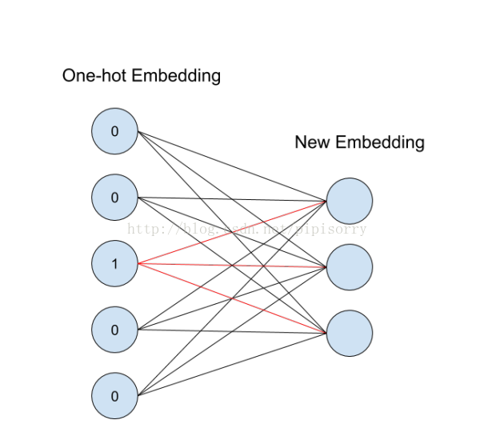

# 深度学习中的embedding

## 数学上
Embedding在数学上表示一个mapping: f:X->Y 也就是一个function
其中该函数满足两个性质
1. injective, 单射的，也就是说Y只有一个X对应。
2. structure-preserving, 结构保存，比如在X所属空间上x_1 <= x_2, 那么映射后在Y所属空间上同理y_1 <= y_2
embedding整体上可以理解为，从一个空间映射到另外一个空间，保留基本属性。

## 深度学习上
Embedding在深度学习上表示编码encoding（动名词/名词）
### One-hot Embedding
假设一共有m个物体，每个物体都有自己的唯一id，那么从物体的集合到Rm(m维向量空间)有一个trivial(平凡解)的嵌入。
就是把它映射到Rm中的标准基，这种嵌入叫做One-hot embedding

应用中一般将物体嵌入到一个低维空间Rn, 就是需要一个从Rm到Rn的线性映射，每一个 n × m 的矩阵M都定义了Rm到Rn的一个线性映射 x -> Mx， 
当x是一个标准基向量的时候， Mx对应矩阵M中的一列，这就是变换后对应id向量的表示。

这个概念用神经网络图来表示如下：

从id找到对应的one-hot embedding,红色的weight就对应输出节点的值

上图：嵌入就是00100编码得到右边的低位线性空间输出

https://blog.csdn.net/pipisorry/article/details/76095118
