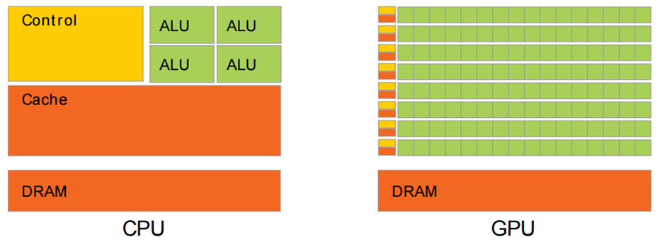

# Graphics Processing Unit
> GPU是显卡的核心,显卡，则是由GPU、显存、电路板，还有BIOS固件组成的，所以GPU不等于显卡。

> GPU只是显卡上的一个核心处理芯片，是显卡的心脏，不能单独作为外接扩展卡使用，GPU因并行计算任务较重，所以功耗较大，只能焊接在显卡的电路板上使用。

## 1. 显卡型号参数大全
N卡：wikipedia:[List of Nvidia graphics processing units](https://en.wikipedia.org/wiki/List_of_Nvidia_graphics_processing_units)

A卡：wikipedia:[List of AMD graphics processing units](https://en.wikipedia.org/wiki/List_of_AMD_graphics_processing_units)

## 2. 图形处理器(GPU)
**为什么GPU计算能力如此强大呢？**

其中Control是控制器、ALU算术逻辑单元、Cache是cpu内部缓存、DRAM就是内存。可以看到GPU设计者将更多的晶体管用作执行单元，而不是像CPU那样用作复杂的控制单元和缓存。从实际来看，CPU芯片空间的5%是ALU，而GPU空间的40%是ALU。这也是导致GPU计算能力超强的原因。

CPU要做得很通用。CPU需要同时很好的支持并行和串行操作，需要很强的通用性来处理各种不同的数据类型，同时又要支持复杂通用的逻辑判断，这样会引入大量的分支跳转和中断的处理。这些都使得CPU的内部结构异常复杂，计算单元的比重被降低了。而GPU面对的则是类型高度统一的、相互无依赖的大规模数据和不需要被打断的纯净的计算环境。因此GPU的芯片比CPU芯片简单很多。

举个例子，假设有一堆相同的加减乘除计算任务需要处理，那把这个任务交给一堆（几十个）小学生就可以了，这里小学生类似于GPU的计算单元，而对一些复杂的逻辑推理等问题，比如公式推导、科技文章写作等高度逻辑化的任务，交给小学生显然不合适，这时大学教授更适合，这里的大学教授就是CPU的计算单元了，大学教授当然能处理加减乘除的问题，单个教授计算加减乘除比单个小学生计算速度更快，但是成本显然高很多。

## 3. 显卡类别
### 独立显卡

高画质和高售价

独立显卡是专门用于图形处理的独立硬件，现在显卡透过PCI-Express扩展插槽与主板连接。

◇性能独立显卡的最大优点是性能。独显不仅提升游戏的画质和流畅度，还使图形处理软件更快和更流畅。

◇价格虽然独立显卡有很多好处，但它成本不菲。经济型的独立显卡需要100美元左右，中端独立显卡售价在250-500美元，最高端的型号价格高达1000美元。

### 集成显卡

免费的显示输出

集成图形处理器，或称集成显卡（集显）、核芯显卡（核显）和内建显示核心，是设在主板或CPU上的图形处理器，运作时会借用计算机内部分的系统内存。

◇性能

集成显卡的性能较弱，因此，集显往往会被认为不适合执行3D游戏或精密的图形运算。

◇价格

2007年，预装集成显卡的个人电脑约占总出货量的90%，相比起使用独立显卡的方案，这种方案可能较为便宜，但性能也许相对较低。

### 对比分析

- **CPU占用率**:独立显卡自带GPU，大量的图像处理都由它来做，电脑的运行更流畅，节省电脑反应的时间。而集成显卡则会占用部分部分CPU内存，电脑的反应速度较慢。

- **内存占用率**:独立显卡自带显存，而集成显卡需要一部分内存作为显存。如果使用集成显卡的电脑内存较小，则电脑运行较慢。

- **图形计算能力**:独立显卡的图形计算能力要比集成显卡强的多。比如在进行3D游戏时，需要大量复杂的计算，集成显卡就显得力不从心了，为了换取较快的游戏速度，只有降低画面质量和特效。

- **功耗**:集成显卡是直接附于主板上，总共的功耗一般十几瓦到几十瓦，而独立显卡本身的功耗就几十瓦甚至二三百瓦再加上主板功耗，所以独显对电脑电源要求较高，导致电脑价格较高。

独显一般是玩游戏 制图 做视频 采集等应用， 集成显卡一般就是办公 上网 高清电影等应用。 一般独显的较贵。

## 4. 显卡供应商
### GPU三大厂商

**英特尔**
英特尔的GPU基本为**集成显卡**芯片，用于英特尔的主板和英特尔的CPU。可能你想不到，要是只按市场占有率计算，英特尔随着他主板及CPU发售的集成GPU占据了整个GPU市场的60%以上。

他的GPU主要有：唯一一款独立显卡芯片Intel 740（i740）。Extreme Graphics系列、GMA系列（集成于芯片组中）。现在的HD Graphics系列、Iris™ Graphics系列、Iris™ Pro Graphics系列等（集成于CPU中）。

**NVIDIA**
NVIDIA是现在最大的**独立显卡**芯片生产销售商。

他的GPU包括大家熟悉的Geforce系列 ，包括GTX、GTS、GT等。

专业工作站的Quadro系列，超级计算的Tesla系列，多显示器商用的NVS系列，移动设备的Tegra系列 。

以前也销售集成在主板上的集成显卡芯片，这些随着主板芯片组一起发售，但是由于AMD收购ATI后自身主板芯片组GPU能力提高，NVIDIA芯片组如日中天的景象已经消失了。

**AMD(ATI)**
AMD是世界上第二大的独立显卡芯片生产销售商，他的前身就是ATI，2006年AMD以54亿美元收购ATI。

他的GPU主要是大家熟悉的Radeon系列，包括以前的X、HD系列，近几年的R9、R7、R5、R3，现在的RX系列等。

专业工作站的FireGL系列，超级计算的FireStream系列，多显示器商用的FireMV系列，现在前三者已合并为FirePro系列。

早期ATI还生产过Wonder系列、Mach系列、Rage系列芯片。

除了独立显卡之外AMD还拥有集成显卡芯片，集成于芯片组、APU中。

由于AMD收购ATI后，其主板市场迅速扩大，已经夺取了NVIDIA在AMD处理器主板芯片组的半壁江山。

就现在的发售量和发售盈利方面，AMD的GPU市场占有率方面仍然略输于NVIDIA。

## 5. 参数详解
### 显卡性能主要由哪些参数决定？

显卡的性能由两个部分决定，一是**核心**，二是**显存**。

**核心和显存的关系**就像电脑中的CPU与内存的关系。

**核心**负责处理运算图形数据，而**显存**则负责缓存图形数据，核心在运算时要用到的数据都是在显存中调用的，所以显存的性能直接决定了核心调用数据的效率，间接影响了显卡的性能。

当我们运行的3D游戏画面非常细腻时，其复杂的图形运算就需要性能强大的核心来应付，而这时候核心的数据吞吐量是非常巨大的，需要容量和带宽足够强大的显存来缓存这些数据。

### 判断显卡的几个要点：

**1.核心型号**

显卡的档次看的就是核心，毫不夸张的说，不管显存或其它参数差别如何巨大，核心差了一档，性能就差了一档，再强的显存也补不回来。比如GT240、HD5670、GTS250、HD5770等等都代表的是核心型号，只要能记住尽可能多的型号，就能非常方便的判断显卡的高低。

**2.核心参数**

参数有很多：

（制作工艺）：比如55纳米、40纳米等等。工艺越先进，功耗就越低，就越能做出高频率的产品

（核心频率）：比如575MHZ、630MHZ、700MHZ等等，频率越高，核心运算速度就越快。

（流处理器数量）：比如48个、96个、216个、800个等等，数量越多，性能越强。不过，N卡和A卡架构不同，相同性能的两个核心，A卡的流处理器数量是N卡的4-5倍，所以两家不能比较流处理器数量。

（流处理器频率）：比如1400MHZ、700MHZ等等，频率越高，性能越强。不过，A卡和N卡架构有区别，N卡的流处理器频率一般是核心频率的两倍以上，而A卡的流处理器频率则与核心频率相同。

**3.显存参数**
显存的作用之前已经提到，越强的核心就需要越强的显存来辅助，当显存性能不足以辅助核心时，就会限制核心性能的发挥，反过来说，当显存性能超出核心需求时，对性能也不会有帮助，反而会增加成本。

当然，无论核心搭配多么弱小的显存，其性能最多也只降一档，不会降两档这么夸张。所以如果有人拿1G显存的GT220跟你换256M显存的GT240，千万别换。

**显存的性能由两个因素决定，一是容量，二是带宽。**
容量很好理解，它的大小决定了能缓存多少数据。

而带宽方面，可理解为显存与核心交换数据的通道，带宽越大，数据交换越快。所以容量和带宽是衡量显存性能的关键因素。

另外，带宽又由频率和位宽两个因素所决定，计算公式为：带宽=频率X位宽/8。

举个例子，两块核心和显存容量相同的显卡，卡1的显存为DDR3 1600MHz频率和128位宽；卡2的显存为DDR2 800MHZ频率和256位宽。看上去两者显存参数不同，但通过公式计算得出，两者都是25.6G/S的带宽，性能是相同的。

- （显存容量, Memory Size）：
常见的容量有128M、256M、512M、896M、1G等等。容量越大，能缓存的数据就越多。

- （显存频率，Bus type）：
一般有DDR2、DDR3、GDDR3、GDDR5等几个类型，GDDR5的频率最高，等效频率能达到4GHZ以上。DDR2频率最慢，有些甚至只有667MHZ。

- （显存位宽, Bus width）：
一般有64bit、128bit、256bit、448bit、512bit等几种。位宽越大，制造难度就越大，成本也就越高，所以很多时候厂商宁可选择低位宽与高频率的组合，这样在保证性能的同时还能降低成本（常见于A卡产品中）。了解了以上要点后，我们基本能判断显卡的高低了。

**不同型号的核心，参数也不同**，比如GT240，官方默认是96个流处理器、40NM工艺、550MHZ核心频率、1340MHZ流处理器频率、3400MHZ显存频率、128显存位宽。而实现产品中，按上面这些官方参数生产的显卡，我们就称之为公版显卡，而达不到这些官方参数的显卡，我们就称之为缩水版显卡，而超出官方参数的显卡，我们就称之为超公版显卡。

### 参数介绍
**1. GFLOPS:**
FLOPS是Floating-point Operations Per Second每秒所执行的浮点运算次数的英文缩写。它是一个衡量计算机计算能力的量，这个量经常使用在那些需要大量浮点运算的科学运算中。有时也会被记为flop/s。

GFLOPS 就是 Giga Floating-point Operations Per Second,即每秒10亿次的浮点运算数,常作为GPU性能参数但不一定代表GPU的实际表现，因为还要考虑具体如何拆分多边形和像素、以及纹理填充，理论上该数值越高越好。1GFlops = 1,000MFlops。

**Memory:** 显存

**2. Bus type:** 决定显存频率，一般有DDR2、DDR3、GDDR3、GDDR5等几个类型, 据悉GDDR6显存总共能够提供14Gbps的显存速度，而目前最快的GDDR5X则是11Gbps. (1Gbps: 每秒1兆bit,数据传输速度).

显存频率一定程度上反应着该显存的速度。显存频率随着显存的类型、性能的不同而不同，SDRAM显存一般都工作在较低的频率上，一般就是133MHz和166MHz，此种频率早已无法满足显卡的需求。DDR SDRAM显存则能提供较高的显存频率，主要在中低端显卡上使用，DDR2显存由于成本高并且性能一般，因此使用量不大。GDDR5显存是目前中高端显卡采用最为广泛的显存类型。不同显存能提供的显存频率也差异很大，中高端显卡显存频率主要有1600MHz、1800MHz、3800MHz、4000MHz、5000MHz等，甚至更高。

**3. Bandwidth:** 显寸带宽：显存带宽是指显示芯片与显存之间的数据传输速率，它以字节/秒为单位。显存带宽是决定显卡性能和速度最重要的因素之一。

计算方式: 

DDR3显存带宽=显存频率×显存位宽/8

DDR5显存带宽=显存频率×显存位宽/8

目前大多低端的显卡都能提供6.4GB/s、8.0GB/s的显存带宽，而对于目前主流级的显卡产品则提供超过75GB/s的显存带宽。在条件允许的情况下，尽可能购买显存带宽大的显卡，这是一个选择的关键。

**4. Memory Size:** 显存容量：

显存容量是显卡上显存的容量数，这是选择显卡的关键参数之一。显存容量决定着显存临时存储数据的多少，显卡显存容量有128MB、256MB、512MB、1024MB几种，64MB和128MB显存的显卡现在已非常少见，主流的是2GB、4GB、8GB的产品。现如今最新显卡已经能达到1TB的显存容量。

**5. Streaming Processor（SP）：** 流处理器：

流处理器就是核心。

每个流处理器当中都有专门高速单元负责解码和执行流数据。

流处理器多少对显卡性能有决定性作用，可以说高中低端的显卡除了核心不同外最主要的差别就在于**流处理器数量**。

**6. CUDA核心：**

CUDA核心，理论上流处理器缩写是SP。但NVIDIA自己称呼他们的SP是CUDA Core。

CUDA Core只是N卡流处理器而已,只是一个流处理器名词。

你可以理解为CUDA是一个基于NVIDIA GPU平台上面NV自己定制的特殊计算体系。是NV自己发明的运算算法，在NV平台和软件支持上面才能发挥最高效率。CUDA在NVIDIA定义是一种类C语言，本身兼容C语言。CUDA虽然是一种独立语言提供开发学习，但CUDA本身和C差距不算非常巨大，很多有经验的开发者很快能学会。

**7. Streaming Multiprocessor（SM）：** 流多处理器：

里面有8个SP，外加2个SFU（Special Function Units）、16K的shared memory等等。无论是G80、G92还是GT200的SM都是包含8个SP，区别在于TPC（Texture/Processor Cluster）中有用几个SM。

GT200有240个SP，它总共有30个SM。

**8. core frequency (Base core clock) ：** 核心频率（显卡频率）：

显卡的核心部分是GPU，核心频率就是GPU的工作频率。

Base core clock实际上是每个核心的工作频率，因此还要加上核心数，才可以算作总频率。

GPU Boost从物理层面，可以这样去理解：当显卡在运行某个3D应用时，因为实际3D运算并未用到所有的晶体管，那么，显卡的实际运行功耗也就与设计TDP存在一定距离，GPU Boost就可以通过提升运行频率，在不超过预先设定的TDP的情况下，用尽剩下的TDP，追求更好的显卡性能。

GPU Boost的存在，使GPU频率首次细分出了多个名称：Base Clock和Boost Clock。前者是GPU核心的基本频率，是NVIDIA保证显卡在3D运算时的频率，与过去的默认频率意义是一样的，Boost Clock则代表经过GPU Boost动态超频后的频率，因为频率会不断地实时调整，Boost Clock没有绝对值(Absolute Value)。

## Reference
1. https://blog.csdn.net/u013165704/article/details/80569424
2. https://www.zhihu.com/question/24272857/answer/172843227
3. https://www.zhihu.com/question/53676443/answer/136042774
4. https://baike.baidu.com/item/%E5%9B%BE%E5%BD%A2%E5%A4%84%E7%90%86%E5%99%A8/8694767?fromtitle=gpu&fromid=105524&fr=aladdin
5. https://zhidao.baidu.com/question/2137478011582251388.html
