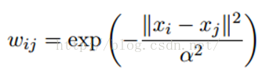
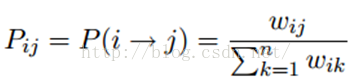
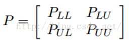
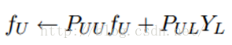
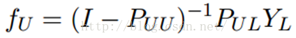

# Label Propagation 标签传播算法

标签传播算法是一种最简单的半监督学习算法

### 相似矩阵构建

LP算法是基于Graph的，因此我们需要先构建一个图。我们为所有的数据构建一个图，图的节点就是一个数据点，包含labeled和unlabeled的数据。节点i和节点j的边表示他们的相似度。这个图的构建方法有很多，这里我们假设这个图是全连接的，节点i和节点j的边权重为：
 

 
这里，α是超参。

还有个非常常用的图构建方法是knn图，也就是只保留每个节点的k近邻权重，其他的为0，也就是不存在边，因此是稀疏的相似矩阵。

### LP算法

标签传播算法非常简单：通过节点之间的边传播label。边的权重越大，表示两个节点越相似，那么label越容易传播过去。我们定义一个NxN的概率转移矩阵P：

Pij表示从节点i转移到节点j的概率。假设有C个类和L个labeled样本，我们定义一个LxC的label矩阵YL，第i行表示第i个样本的标签指示向量，即如果第i个样本的类别是j，那么该行的第j个元素为1，其他为0。同样，我们也给U个unlabeled样本一个UxC的label矩阵YU。把他们合并，我们得到一个NxC的soft label矩阵F=[YL;YU]。soft label的意思是，我们保留样本i属于每个类别的概率，而不是互斥性的，这个样本以概率1只属于一个类。当然了，最后确定这个样本i的类别的时候，是取max也就是概率最大的那个类作为它的类别的。那F里面有个YU，它一开始是不知道的，那最开始的值是多少？无所谓，随便设置一个值就可以了。

千呼万唤始出来，简单的LP算法如下：

       1）执行传播：F=PF

       2）重置F中labeled样本的标签：FL=YL

       3）重复步骤1）和2）直到F收敛。

步骤1）就是将矩阵P和矩阵F相乘，这一步，每个节点都将自己的label以P确定的概率传播给其他节点。如果两个节点越相似（在欧式空间中距离越近），那么对方的label就越容易被自己的label赋予，就是更容易拉帮结派。

步骤2）非常关键，因为labeled数据的label是事先确定的，它不能被带跑，所以每次传播完，它都得回归它本来的label。随着labeled数据不断的将自己的label传播出去，最后的类边界会穿越高密度区域，而停留在低密度的间隔中。相当于每个不同类别的labeled样本划分了势力范围。

### 改进LP算法
我们知道，我们每次迭代都是计算一个soft label矩阵F=[YL;YU]，但是YL是已知的，计算它没有什么用，在步骤2）的时候，还得把它弄回来。我们关心的只是YU，那我们能不能只计算YU呢？Yes。我们将矩阵P做以下划分：
 

这时候，我们的算法就一个运算：

 
迭代上面这个步骤直到收敛就ok了，是不是很cool。可以看到FU不但取决于labeled数据的标签及其转移概率，还取决了unlabeled数据的当前label和转移概率。因此LP算法能额外运用unlabeled数据的分布特点。

这个算法的收敛性也非常容易证明，具体见参考文献[1]。实际上，它是可以收敛到一个凸解的：

所以我们也可以直接这样求解，以获得最终的YU。但是在实际的应用过程中，由于矩阵求逆需要O(n3)的复杂度，所以如果unlabeled数据非常多，那么I – PUU矩阵的求逆将会非常耗时，因此这时候一般选择迭代算法来实现。

https://blog.csdn.net/zouxy09/article/details/49105265
