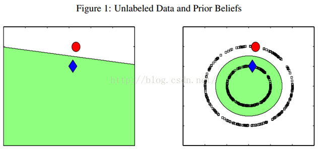

# Semi-supervised learning 半监督学习

机器学习可以大体分为三大类：监督学习、非监督学习和半监督学习。监督学习可以认为是我们有非常多的labeled标注数据来train一个模型，期待这个模型能学习到数据的分布，以期对未来没有见到的样本做预测。那这个性能的源头--训练数据，就显得非常感觉。你必须有足够的训练数据，以覆盖真正现实数据中的样本分布才可以，这样学习到的模型才有意义。那非监督学习就是没有任何的labeled数据，就是平时所说的聚类了，利用他们本身的数据分布，给他们划分类别。而半监督学习，顾名思义就是处于两者之间的，只有少量的labeled数据，我们试图从这少量的labeled数据和大量的unlabeled数据中学习到有用的信息。

### 半监督学习

半监督学习（Semi-supervised learning）发挥作用的场合是：你的数据有一些有label，一些没有。而且一般是绝大部分都没有，只有少许几个有label。半监督学习算法会充分的利用unlabeled数据来捕捉我们整个数据的潜在分布。它基于三大假设：

       1）Smoothness平滑假设：相似的数据具有相同的label。

       2）Cluster聚类假设：处于同一个聚类下的数据具有相同label。

       3）Manifold流形假设：处于同一流形结构下的数据具有相同label。
       
例如下图，只有两个labeled数据，如果直接用他们来训练一个分类器，例如LR或者SVM，那么学出来的分类面就是左图那样的。如果现实中，这个数据是右图那边分布的话，猪都看得出来，左图训练的这个分类器烂的一塌糊涂、惨不忍睹。因为我们的labeled训练数据太少了，都没办法覆盖我们未来可能遇到的情况。但是，如果右图那样，把大量的unlabeled数据（黑色的）都考虑进来，有个全局观念，牛逼的算法会发现，哎哟，原来是两个圈圈（分别处于两个圆形的流形之上）！那算法就很聪明，把大圈的数据都归类为红色类别，把内圈的数据都归类为蓝色类别。因为，实践中，labeled数据是昂贵，很难获得的，但unlabeled数据就不是了，写个脚本在网上爬就可以了，因此如果能充分利用大量的unlabeled数据来辅助提升我们的模型学习，这个价值就非常大。

https://blog.csdn.net/zouxy09/article/details/49105265
