# 损失函数
## 简介

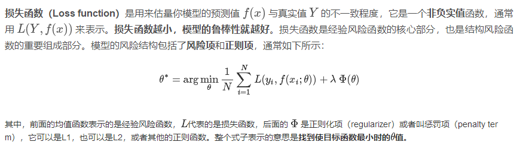

## 常用损失函数

常见的损失误差有五种： 
1. 铰链损失（Hinge Loss）：主要用于支持向量机（SVM） 中； 
2. 互熵损失（Cross Entropy Loss，Softmax Loss ）：用于Logistic 回归与Softmax 分类中； 
3. 平方损失（Square Loss）：主要是最小二乘法（OLS）中； 
4. 指数损失（Exponential Loss） ：主要用于Adaboost 集成学习算法中； 
5. 其他损失（如0-1损失，绝对值损失）

### 1.Hinge loss 

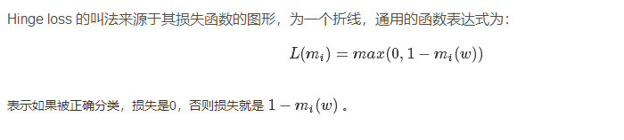

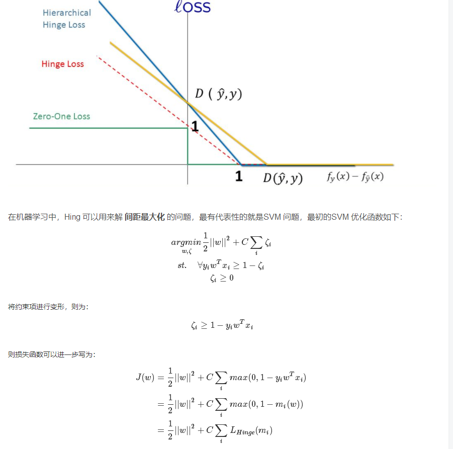

因此， SVM 的损失函数可以看作是 L2-norm 和 Hinge loss 之和。

### 2.Softmax loss
有些人可能觉得逻辑回归的损失函数就是平方损失，其实并不是。平方损失函数可以通过线性回归在假设样本是高斯分布的条件下推导得到，而逻辑回归得到的并不是平方损失。在逻辑回归的推导中，它假设样本服从伯努利分布（0-1分布），然后求得满足该分布的似然函数，接着取对数求极值等等。而逻辑回归并没有求似然函数的极值，而是把极大化当做是一种思想，进而推导出它的经验风险函数为：最小化负的似然函数（即maxF(y,f(x))→min−F(y,f(x)))maxF(y,f(x))→min−F(y,f(x)))。从损失函数的视角来看，它就成了Softmax 损失函数了。

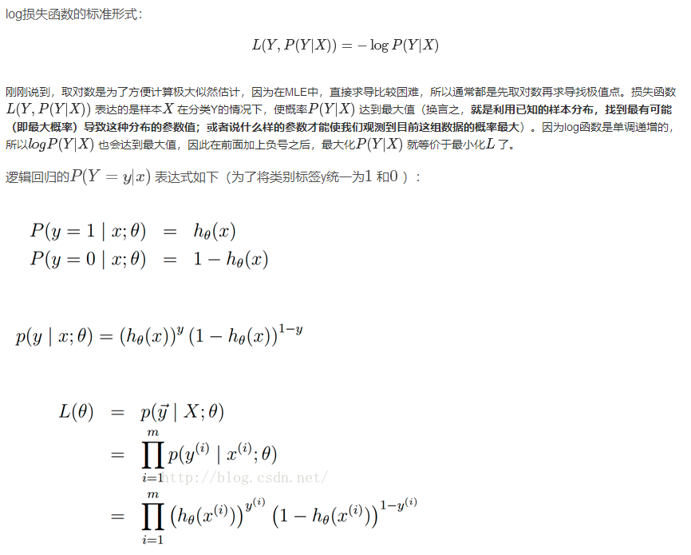

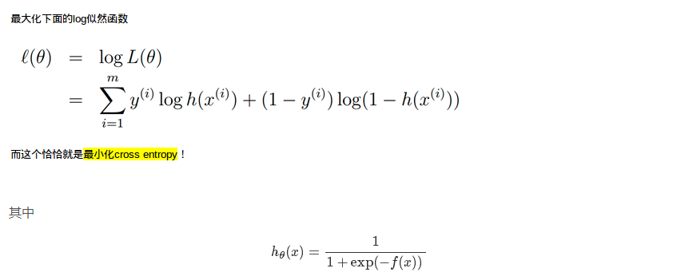

### 3.Squared loss

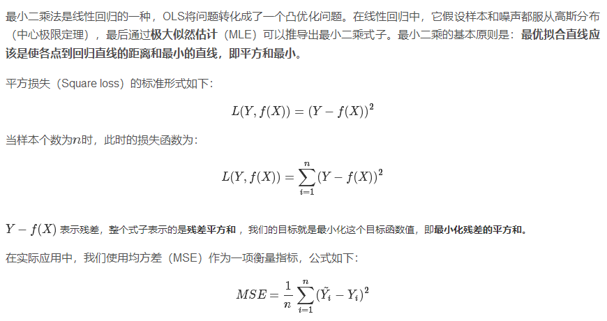

### 4.Exponentially loss

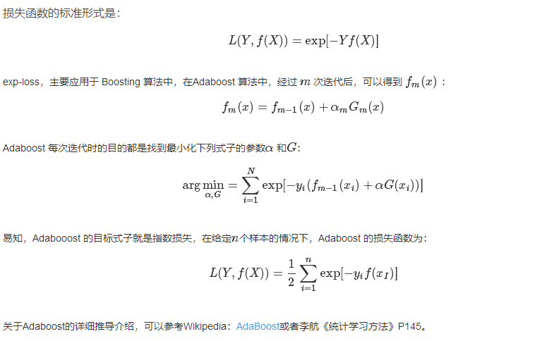

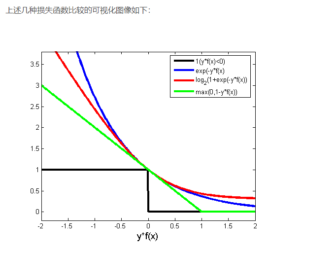

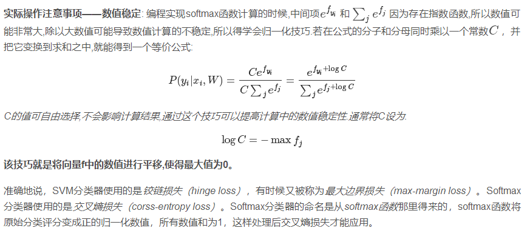

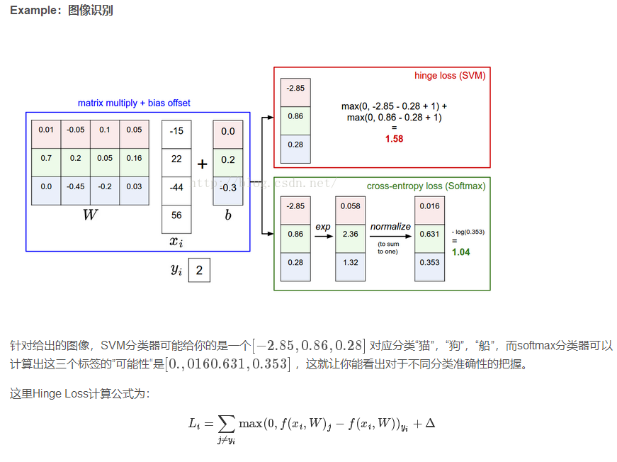

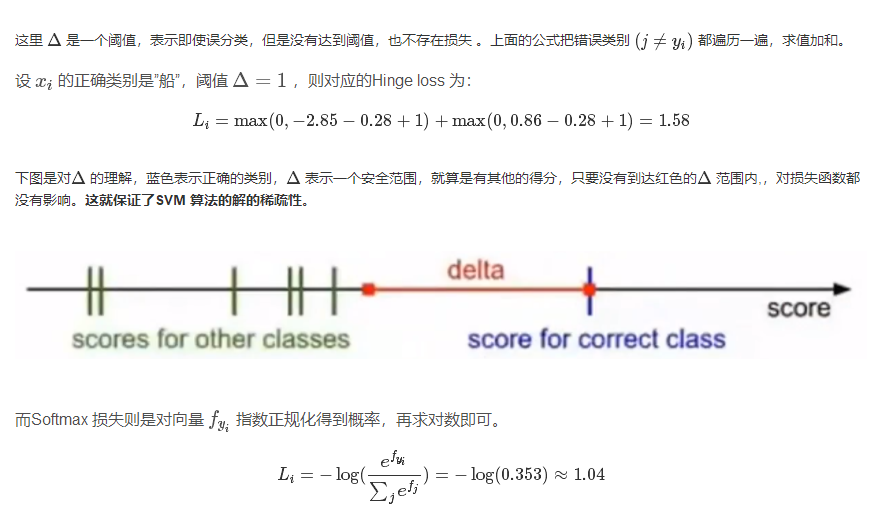

https://blog.csdn.net/u010976453/article/details/78488279
