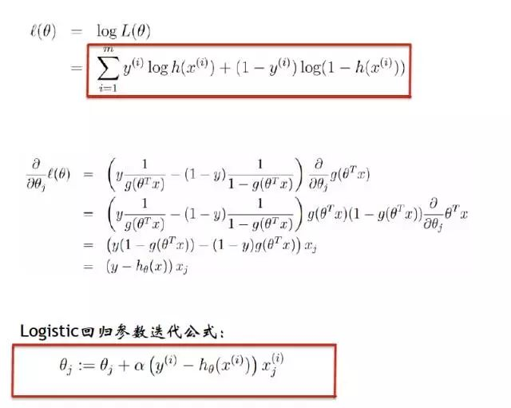
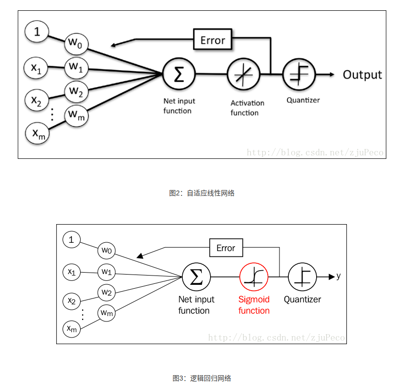

# 逻辑回归理解

## 逻辑回归
逻辑回归实际上是用于分类，所以它的损失函数示log loss,对应的分布是伯努力分布(0-1分布)。

学习笔记：

https://blog.csdn.net/zouxy09/article/details/20319673

https://blog.csdn.net/zjuPeco/article/details/77165974

## 逻辑回归与线性回归
逻辑回归和线性回归首先都是广义的线性回归，

经典线性模型的优化目标函数是最小二乘

逻辑回归则是似然函数

另外线性回归在整个实数域范围内进行预测，敏感度一致，而分类范围，需要在[0,1]。逻辑回归就是一种减小预测范围，将预测值限定为[0,1]间的一种回归模型，因而对于这类问题来说，逻辑回归的鲁棒性比线性回归的要好。

逻辑回归的模型本质上是一个线性回归模型，逻辑回归都是以线性回归为理论支持的。但线性回归模型无法做到sigmoid的非线性形式，sigmoid可以轻松处理0/1分类问题。

相当于，线性回归的激活函数是用 y = x, 逻辑回归的激活函数是sigmoid函数

## 逻辑回归与SVM

1、LR和SVM都可以处理分类问题，且一般都用于处理线性二分类问题（在改进的情况下可以处理多分类问题）

2、两个方法都可以增加不同的正则化项，如l1、l2等等。所以在很多实验中，两种算法的结果是很接近的。

区别： 1、LR是参数模型，SVM是非参数模型。

2、从目标函数来看，区别在于逻辑回归采用的是logistical loss，SVM采用的是hinge loss.这两个损失函数的目的都是增加对分类影响较大的数据点的权重，减少与分类关系较小的数据点的权重。

3、SVM的处理方法是只考虑support vectors，也就是和分类最相关的少数点，去学习分类器。而逻辑回归通过非线性映射，大大减小了离分类平面较远的点的权重，相对提升了与分类最相关的数据点的权重。

4、逻辑回归相对来说模型更简单，好理解，特别是大规模线性分类时比较方便。而SVM的理解和优化相对来说复杂一些，SVM转化为对偶问题后,分类只需要计算与少数几个支持向量的距离,这个在进行复杂核函数计算时优势很明显,能够大大简化模型和计算。

5、logic 能做的 svm能做，但可能在准确率上有问题，svm能做的logic有的做不了。

https://zhuanlan.zhihu.com/p/30301789
