# Pytorch
## Overview
### 明确定义了三层抽象：

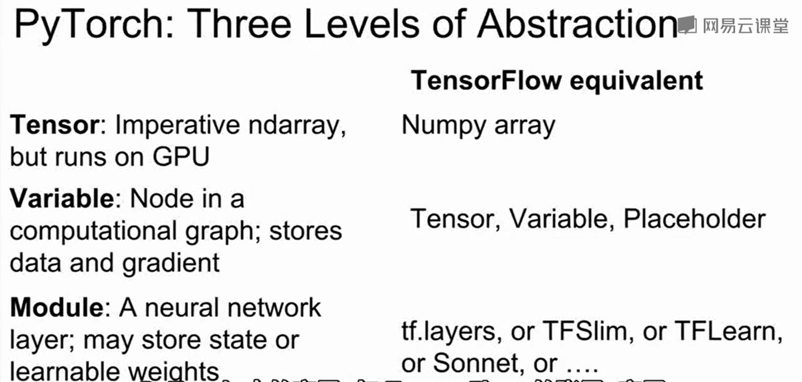

### Pytorch: Tensor
定义方式，前向传播，反向传播，更新权值的方式

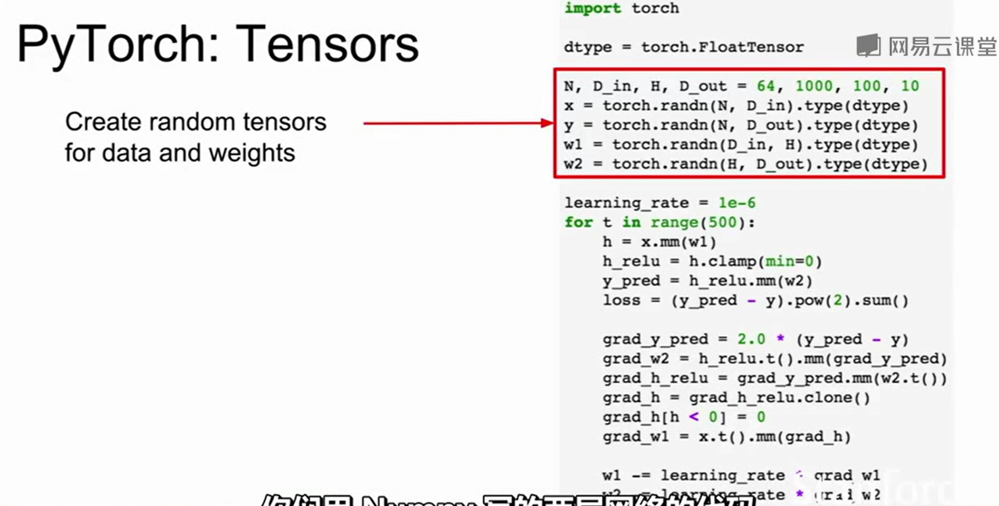

使用gpu计算时的实现方式：

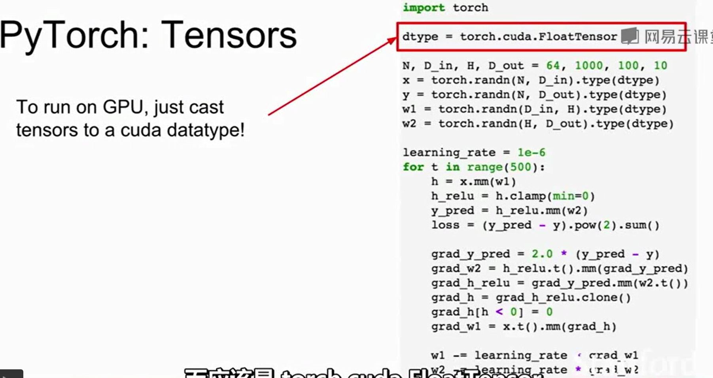

### Pytorch: Tensor

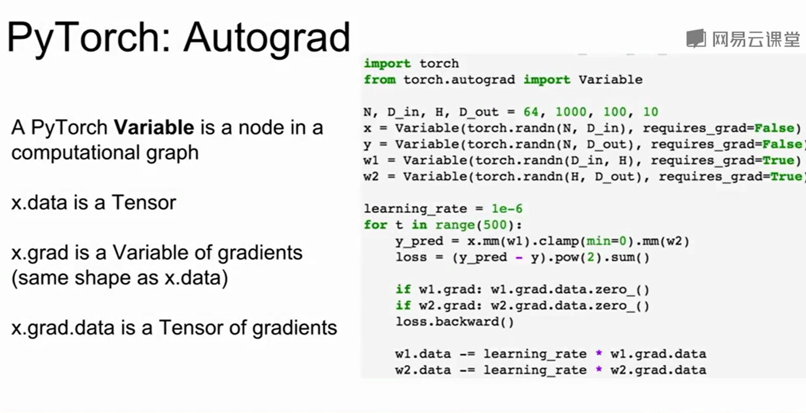

这里x是一个变量，那么x.data就是一个tensor

x.grad就是另一个变量，包含了损失

x.grad.data就是包含梯度的Tensor

在Pytorch上的Tensor和Variable有相同的API

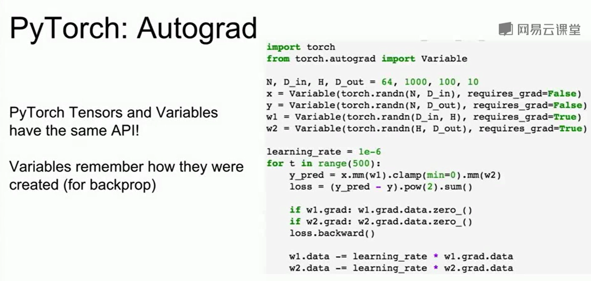

定义的时候告诉构造器，该不该在变量上计算梯度：

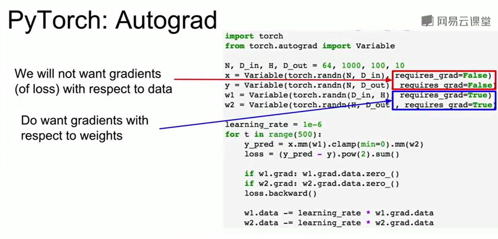

##### Tensorflow与Pytorch
 - tensorflow是先构建显示的图，之后计算
 
 - Pytorch是每次前向传播时都要构建一个新图，这个程序看上去要简单一点 

### 自定义函数
在Pytorch我们可以自己定义变量的前向和后向，
 
可以构造新的autograd函数

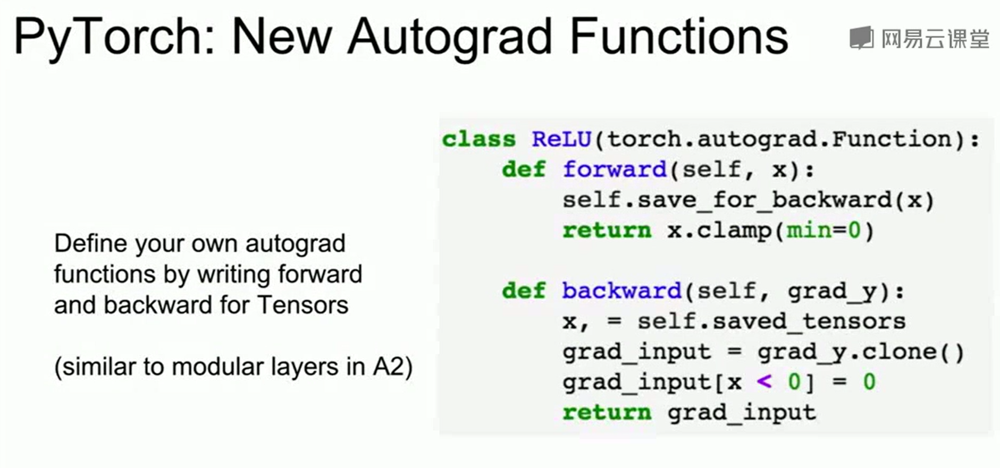

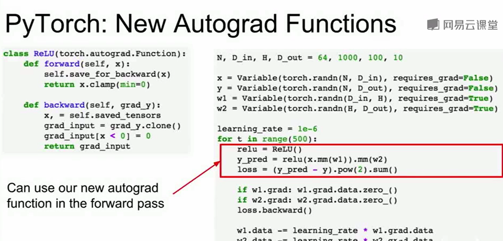

但是，大多数的时候，你不需要自己定义函数，因为一些高层wrappers已经把这些实现都准备好了

## Pytorch: nn
### 很类似keras的model

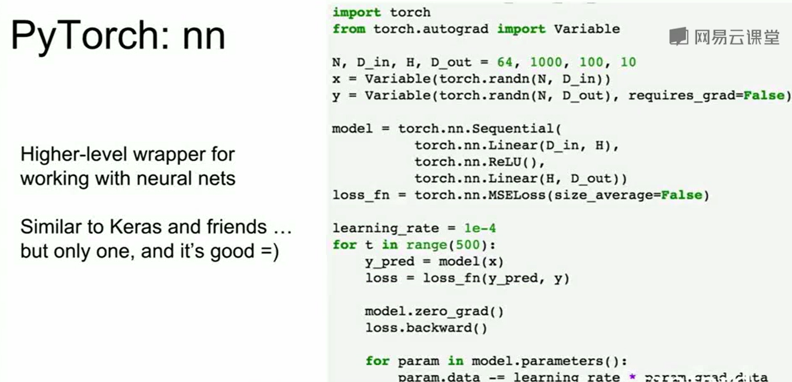

### 使用optimizer训练

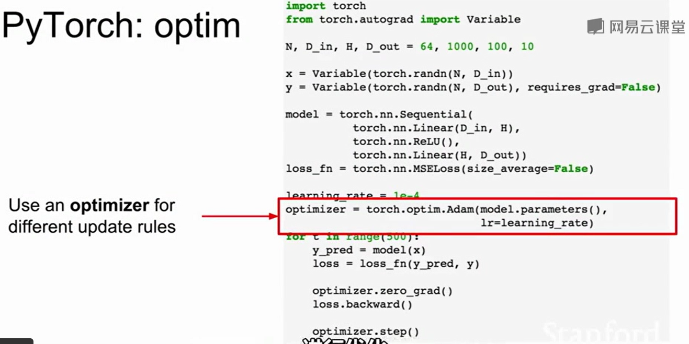

通过optimizer.step()迭代更新

### Pytorch: Modules
pytorch一般定义模型都要新建一个类

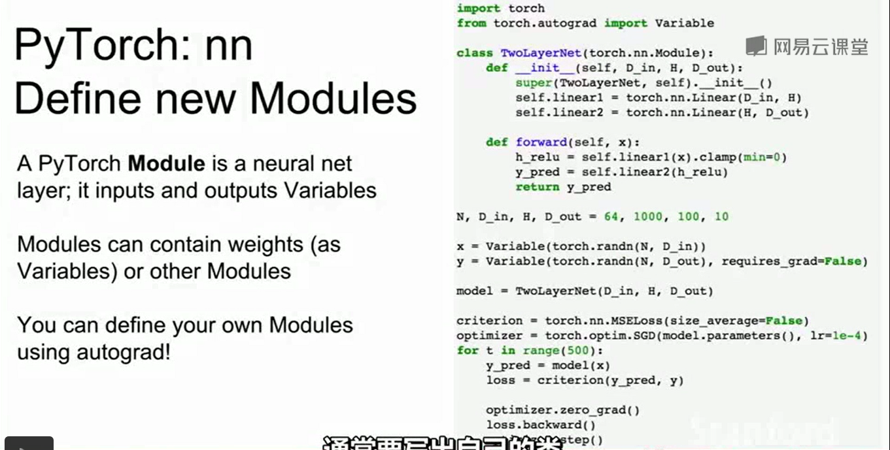

### Pytorch: DataLoaders
DataLoaders可以处理建立mini batches，也可以处理多线程的问题

事实上它可以用多线程建立很多批处理

每次迭代都可以产生分批的数据，然后在其内部重排数据，多线程加载数据

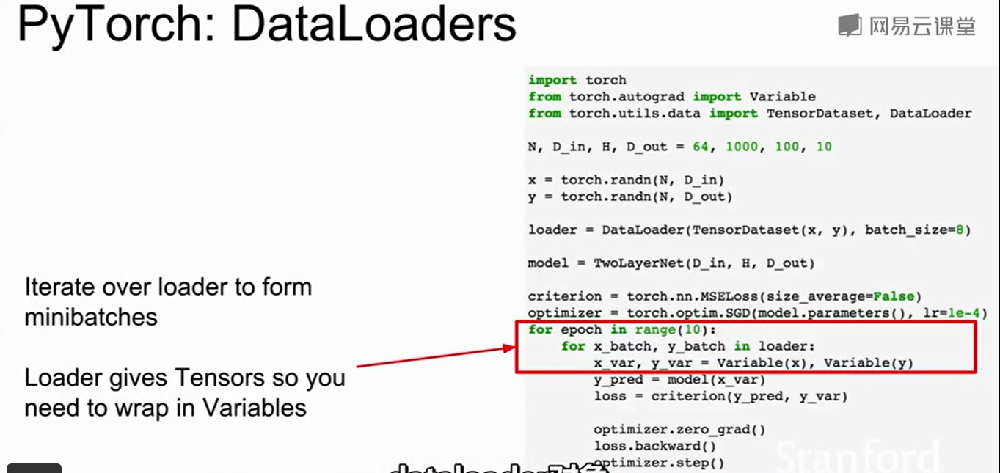

### Pytorch: Pretrained Model
大概是最容易使用Pretrained Model的方法

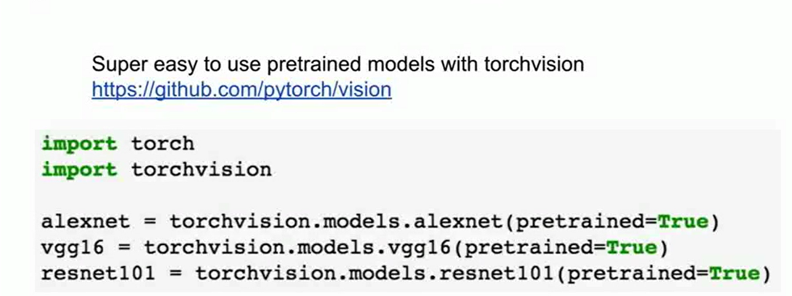

### Pytorch: visdom
可视化很多损失统计，类似于Tensorboard

但是Tensorboard可以让你可视化很多计算图的过程，visdom还没有这个功能

### Tensorflow静态图，Pytorch动态图

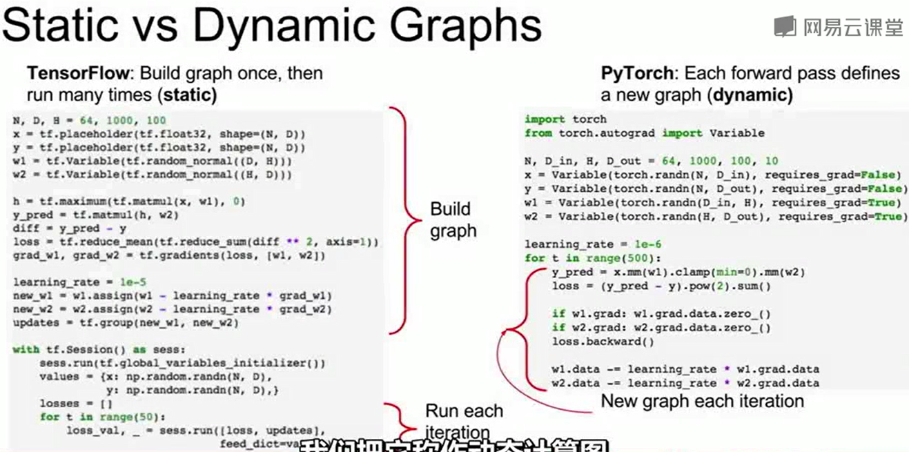

Tensorflow(static graph)中事先构建图，之后每次跑都不用再构建图，所以当多次使用图的时候，效率会比较高

但是Dynamic graph灵活性更好，例如下面的例子：条件判定

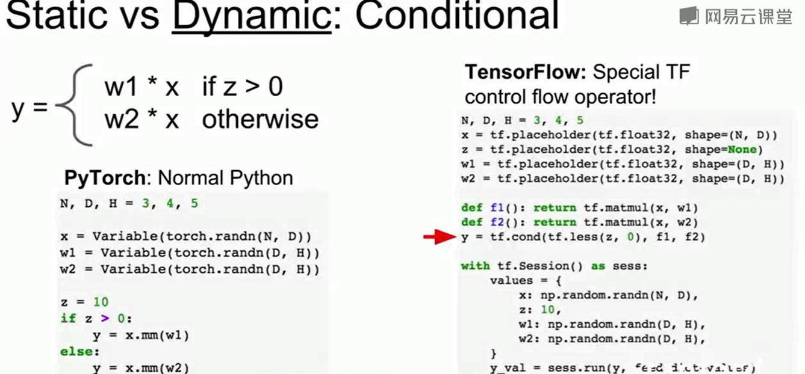

如果遇到条件判定，像Tensorflow这样的静态图，会产生一个很多的分支，所有控制流路径都要提前建立好，
例如需要Tensorflow的流操作：eg: tf.cond
但是Dynamic就会像Python控制流一样判定

另一个例子：循环

这样的情况Pytorch只需要使用一个循环，并不依赖于我们输入数据的大小

Tensorflow实现就需要特殊的控制流：

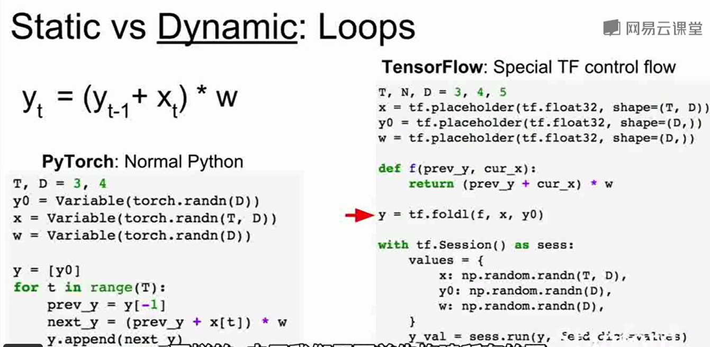

我们需要在控制流中设置一个显式的节点，而且Tensorflow这样设计需要熟悉函数式编程

使用tf.foldl来实现特定的循环结构

##### 关键：计算图相当于用Tensorflow自己的编程语言，任何控制流操作，任何数据结构都需要合并在计算图中，所以并不能用Python的范式来完成工作

##### 所以倾向于使用Pytorch的结构会更好一些，可以使用任何Python中的编程结构，而且也可以工作的很好

##### Tensorflow Fold
支持 Dynamic Graph in Tensorflow

常用Dynamic Graph Applications
- Recurrent networks  依赖时间序列信息的循环神经网络
- Recursive networks  常用于自然语言处理的递归神经网路（因为需要parse语法树）
- Modular Networks 回答问题的网络
这些都是Tensorflow很难去实现的，需要Pytorch做会好一些

现存框架：

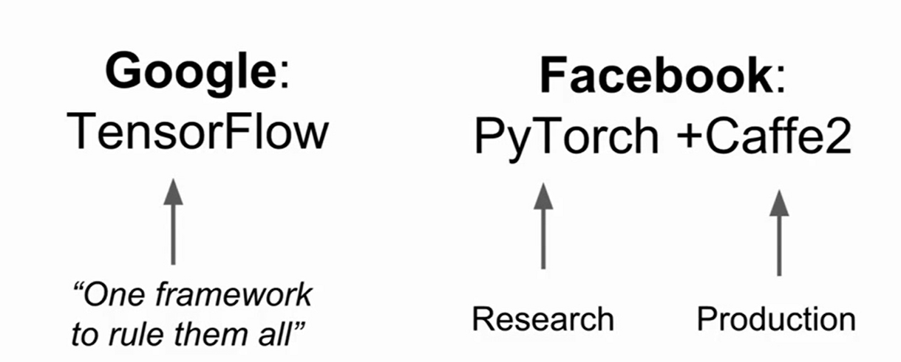

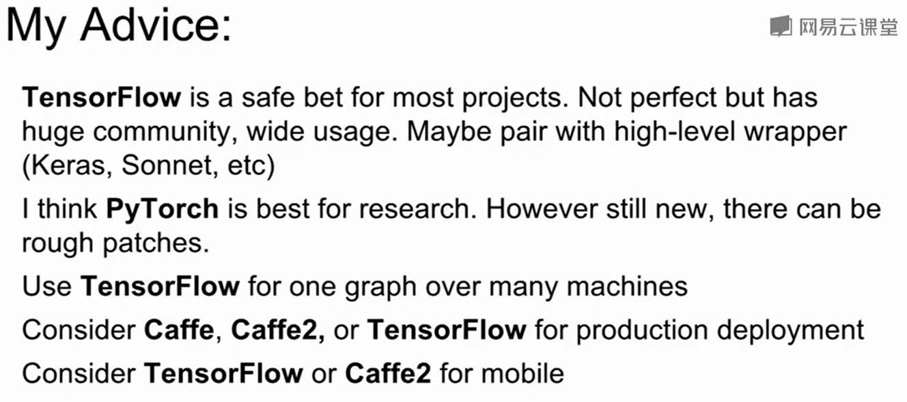

From Stanford.cs231n
