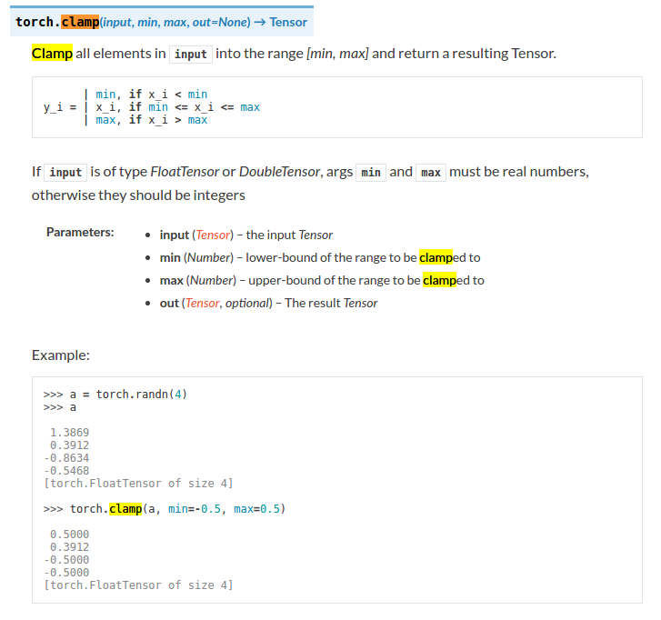

# style transfer实现中用到的一些pytorch用法

### 1.torchvision.transforms
torchvision.transforms是pytorch中的图像预处理包

一般用Compose把多个步骤整合到一起：

比如说

transforms.Compose([

transforms.CenterCrop(10),

transforms.ToTensor(),

])

这样就把两个步骤整合到一起

接下来介绍transforms中的函数

Resize：把给定的图片resize到given size

Normalize：Normalized an tensor image with mean and standard deviation

ToTensor：convert a PIL image to tensor (H*W*C) in range [0,255] to a torch.Tensor(C*H*W) in the range [0.0,1.0]

ToPILImage: convert a tensor to PIL image

Scale：目前已经不用了，推荐用Resize

CenterCrop：在图片的中间区域进行裁剪

RandomCrop：在一个随机的位置进行裁剪

RandomHorizontalFlip：以0.5的概率水平翻转给定的PIL图像

RandomVerticalFlip：以0.5的概率竖直翻转给定的PIL图像

RandomResizedCrop：将PIL图像裁剪成任意大小和纵横比

Grayscale：将图像转换为灰度图像

RandomGrayscale：将图像以一定的概率转换为灰度图像

FiceCrop：把图像裁剪为四个角和一个中心

ColorJitter：随机改变图像的亮度对比度和饱和度

使用的时候,是对单张图片处理：
```python
loader = transforms.Compose([
    transforms.Scale(imsize),
    transforms.ToTensor()])
    
image = Image.open("sample.png")
image = Variable(loader(image))
```
### 2.squeeze与unsqueeze
torch.squeeze() 对于tensor变量进行维度压缩，去除维数为1的的维度。例如一矩阵维度为A*1*B*C*1*D，通过squeeze()返回向量的维度为A*B*C*D。squeeze(a)，表示将a的维数位1的维度删掉，squeeze(a,N)表示，如果第N维维数为1，则压缩去掉，否则a矩阵不变

torch.unsqueeze() 是squeeze
()的反向操作，增加一个维度，该维度维数为1，可以指定添加的维度。例如unsqueeze(a,1)表示在1这个维度进行添加

### 3.torch.mm()和torch.matmul()
对矩阵mat1和mat2进行相乘。 如果mat1 是一个n×m张量，mat2 是一个 m×p 张量，将会输出一个 n×p 张量out。

参数 ：

    mat1 (Tensor) – 第一个相乘矩阵
    mat2 (Tensor) – 第二个相乘矩阵
    out (Tensor, optional) – 输出张量

```python
a, b, c, d = input.size()
features = input.view(a * b, c * d)
G = torch.mm(features, features.t())
return G.div(a * b * c * d)
```

### 4.torch.div(value)函数，或者Tensor.div(value)
对Tensor除以一个固定的数value，要求Tensor的type必须是FloatTensor或者DoubleTensor

### 5.关于torchvision.models.vgg19()相关用法
Tips:

Python列表脚本操作符

列表对 + 和 * 的操作符与字符串相似。+ 号用于组合列表，* 号用于重复列表。

如下所示：

len([1, 2, 3])	3	长度

[1, 2, 3] + [4, 5, 6]	[1, 2, 3, 4, 5, 6]	组合

a = [1, 2]

a += [3, 4, 5]

#### VGG19内部实现源码(torchvision.models.vgg.py)：
```python
class VGG(nn.Module):

    def __init__(self, features, num_classes=1000, init_weights=True):
        super(VGG, self).__init__()
        self.features = features
        self.classifier = nn.Sequential(
            nn.Linear(512 * 7 * 7, 4096),
            nn.ReLU(True),
            nn.Dropout(),
            nn.Linear(4096, 4096),
            nn.ReLU(True),
            nn.Dropout(),
            nn.Linear(4096, num_classes),
        )
        if init_weights:
            self._initialize_weights()

    def forward(self, x):
        x = self.features(x)
        x = x.view(x.size(0), -1)
        x = self.classifier(x)
        return x

    def _initialize_weights(self):
        for m in self.modules():
            if isinstance(m, nn.Conv2d):
                n = m.kernel_size[0] * m.kernel_size[1] * m.out_channels
                m.weight.data.normal_(0, math.sqrt(2. / n))
                if m.bias is not None:
                    m.bias.data.zero_()
            elif isinstance(m, nn.BatchNorm2d):
                m.weight.data.fill_(1)
                m.bias.data.zero_()
            elif isinstance(m, nn.Linear):
                m.weight.data.normal_(0, 0.01)
                m.bias.data.zero_()


def make_layers(cfg, batch_norm=False):
    layers = []
    in_channels = 3
    for v in cfg:
        if v == 'M':
            layers += [nn.MaxPool2d(kernel_size=2, stride=2)]
        else:
            conv2d = nn.Conv2d(in_channels, v, kernel_size=3, padding=1)
            if batch_norm:
                layers += [conv2d, nn.BatchNorm2d(v), nn.ReLU(inplace=True)]
            else:
                layers += [conv2d, nn.ReLU(inplace=True)]
            in_channels = v
    return nn.Sequential(*layers)


cfg = {
    'A': [64, 'M', 128, 'M', 256, 256, 'M', 512, 512, 'M', 512, 512, 'M'],
    'B': [64, 64, 'M', 128, 128, 'M', 256, 256, 'M', 512, 512, 'M', 512, 512, 'M'],
    'D': [64, 64, 'M', 128, 128, 'M', 256, 256, 256, 'M', 512, 512, 512, 'M', 512, 512, 512, 'M'],
    'E': [64, 64, 'M', 128, 128, 'M', 256, 256, 256, 256, 'M', 512, 512, 512, 512, 'M', 512, 512, 512, 512, 'M'],
}

def vgg19(pretrained=False, **kwargs):
    """VGG 19-layer model (configuration "E")

    Args:
        pretrained (bool): If True, returns a model pre-trained on ImageNet
    """
    if pretrained:
        kwargs['init_weights'] = False
    model = VGG(make_layers(cfg['E']), **kwargs)
    if pretrained:
        model.load_state_dict(model_zoo.load_url(model_urls['vgg19']))
    return model
    
```
使用：
```python
self.loss_network = models.vgg19(pretrained=True)
```
model_zoo是和导入预训练模型相关的包，另外all变量定义了可以从外部import的函数名或类名。这也是前面为什么可以用torchvision.models.resnet50()来调用的原因。model_urls这个字典是预训练模型的下载地址。
```python
import torch.nn as nn
import math
import torch.utils.model_zoo as model_zoo

__all__ = [
    'VGG', 'vgg11', 'vgg11_bn', 'vgg13', 'vgg13_bn', 'vgg16', 'vgg16_bn',
    'vgg19_bn', 'vgg19',
]


model_urls = {
    'vgg11': 'https://download.pytorch.org/models/vgg11-bbd30ac9.pth',
    'vgg13': 'https://download.pytorch.org/models/vgg13-c768596a.pth',
    'vgg16': 'https://download.pytorch.org/models/vgg16-397923af.pth',
    'vgg19': 'https://download.pytorch.org/models/vgg19-dcbb9e9d.pth',
    'vgg11_bn': 'https://download.pytorch.org/models/vgg11_bn-6002323d.pth',
    'vgg13_bn': 'https://download.pytorch.org/models/vgg13_bn-abd245e5.pth',
    'vgg16_bn': 'https://download.pytorch.org/models/vgg16_bn-6c64b313.pth',
    'vgg19_bn': 'https://download.pytorch.org/models/vgg19_bn-c79401a0.pth',
}
```
#### 保存模型加载模型
```python
# 保存和加载整个模型
torch.save(model_object, 'model.pkl')
model = torch.load('model.pkl')

# 仅保存和加载模型参数(推荐使用)
torch.save(model_object.state_dict(), 'params.pkl')
model_object.load_state_dict(torch.load('params.pkl'))
```
### 6.torch.clamp_函数
clamp表示夹紧，夹住的意思，torch.clamp(input,min,max,out=None)-> Tensor

将input中的元素限制在[min,max]范围内并返回一个Tensor

用法：



##### pytorch 常用函数积累
https://blog.csdn.net/sugar_girl/article/details/79695952
