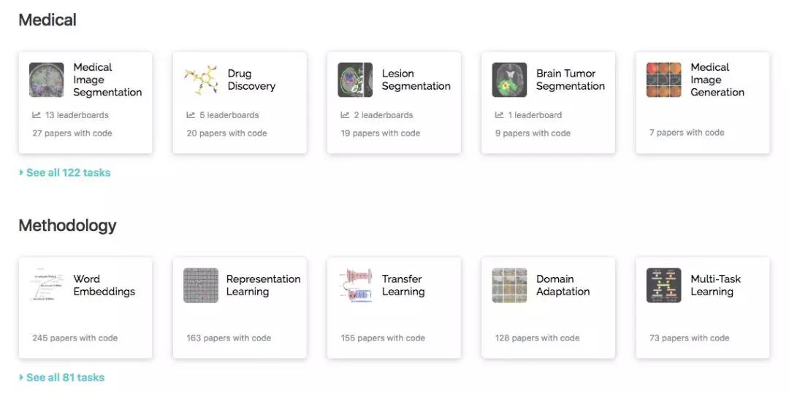

# itsumo-cv

### 资源链接
##### 1. Papers With Code (Recommended)

提供免费开源的机器学习论文资源，代码和评估排行榜

AI所有领域最优论文：https://paperswithcode.com/sota

数据下载
- 论文摘要：https://paperswithcode.com/media/about/papers-with-abstracts.json.gz
- 论文与代码之间的链接：https://paperswithcode.com/media/about/links-between-papers-and-code.json.gz
- 评估排行榜：https://paperswithcode.com/media/about/evaluation-tables.json.gz
##### 2. ArXiv检索工具
Arxiv Sanity Preserver: www.arxiv-sanity.com

ArXiv CV板块https://arxiv.org/list/cs.CV/recent

ArXiv 国内镜像：如https://arxiv.org/pdf/1512.03385.pdf下载很慢，换成http://xxx.itp.ac.cn/pdf/1512.03385.pdf
##### 3. Pytorch相关上层库

##### **TorchGAN** :
TorchGAN 是基于 PyTorch 的 GAN 设计开发框架。该框架旨在为流行的 GAN 提供构造模块，且允许为前沿研究进行定制化。

项目地址：https://github.com/torchgan/torchgan

文档地址：https://torchgan.readthedocs.io/en/latest/

通过pip就可以安装orchGAN

##### 4. 计算机视觉索引

涵盖了所有计算机视觉里面所有topic，所有subtopic的著作，包括论文，教材，还对各类主题的关键词。这个网站在Szeliski等人的书应该都有提及。Price坚持了23年，频繁更新，收录每个方向重要期刊，会议文献和书籍，并且保证了所有链接不失效。

http://www.visionbib.com/index.php

每段文字有超链接，CV的知识框架和思维导图。对于研究生来说，掌握大方向和关键词就是入门了。不一定有时间去翻完一本书，推理每个公式。通过这个bibliography, 既可以获得一个big picture，又能在你感兴趣的小领域里，借助里面的超链接，从研究的源头一眼扫到当今state-of-the-arts。剩下的就是在这个领域里坚持不懈的grinding，遇到不懂的细节回去找书本，推理一遍。

##### 5. GAN papers总结

https://github.com/zhangqianhui/AdversarialNetsPapers

##### 6. 图像处理与计算机视觉基础，经典以及最近发展

https://www.cnblogs.com/jiahenhe2/p/7912210.html

##### 7. 计算机视觉领域的一些博客，超有实力的研究机构等的网站链接

https://blog.csdn.net/carson2005/article/details/6601109

##### 8. 机器视觉开源代码集合

https://blog.csdn.net/carson2005/article/details/54620112

##### 9. AI广角镜（AI Literature Panorama）

http://aipano.cse.ust.hk

##### 10. 图形学，视觉论文阅读资源

http://kesen.realtimerendering.com/

siga: http://kesen.realtimerendering.com/siga2018Papers.htm

siggraph: https://s2018.siggraph.org/conference/conference-overview/technical-papers/

##### 11. 计算机视觉领域顶级会议时间表
[Jackie Tseng](https://github.com/JackieTseng/conference_call_for_paper)

https://jackietseng.github.io/conference_call_for_paper/2018-2019-conferences-with-ccf.html

##### 12. AI SOTA(State of The Art)论文

https://www.stateoftheart.ai/

