# numpy,tensorflow,pytorch比较
## overview

### numpy
略
### tensorflow:
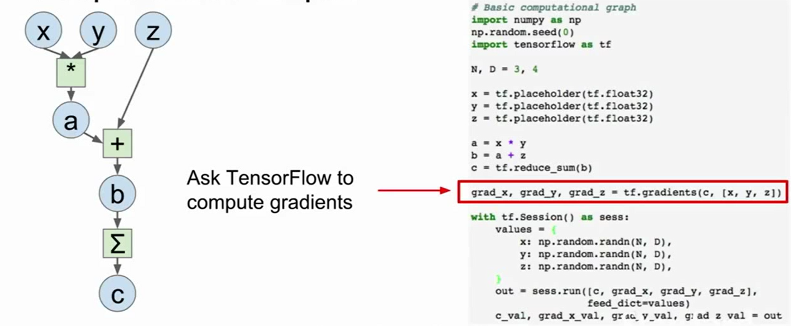
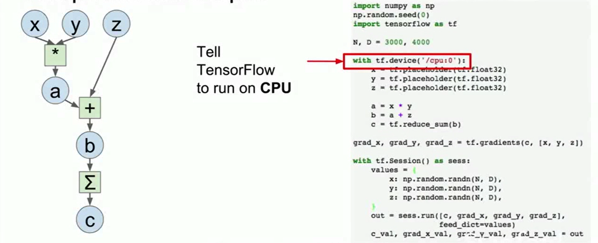

### pytorch:
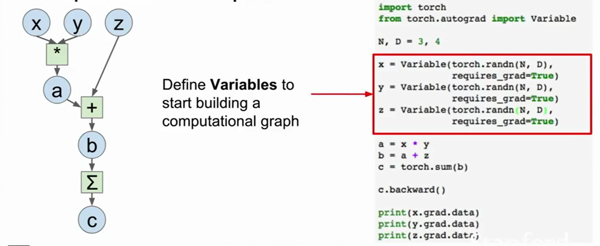
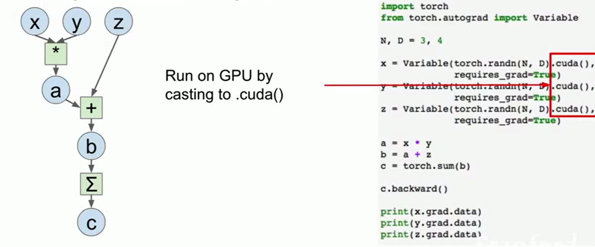

### 代码比较
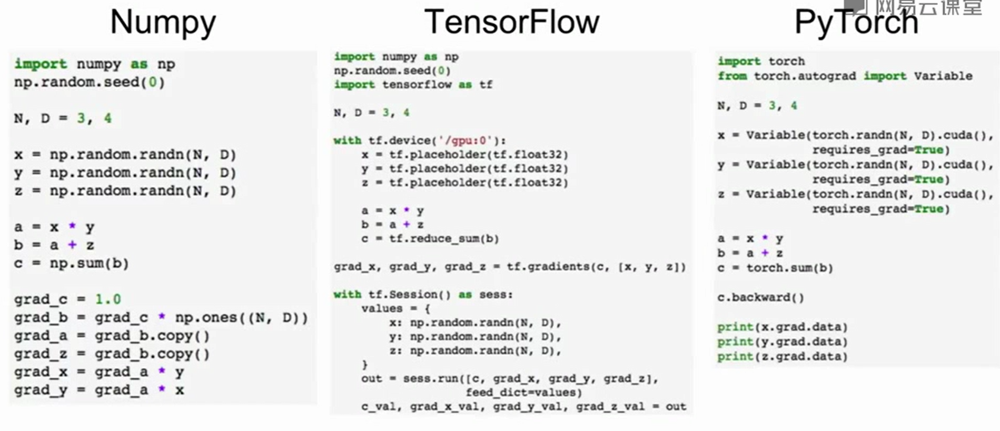

## tensorflow:
计算梯度：
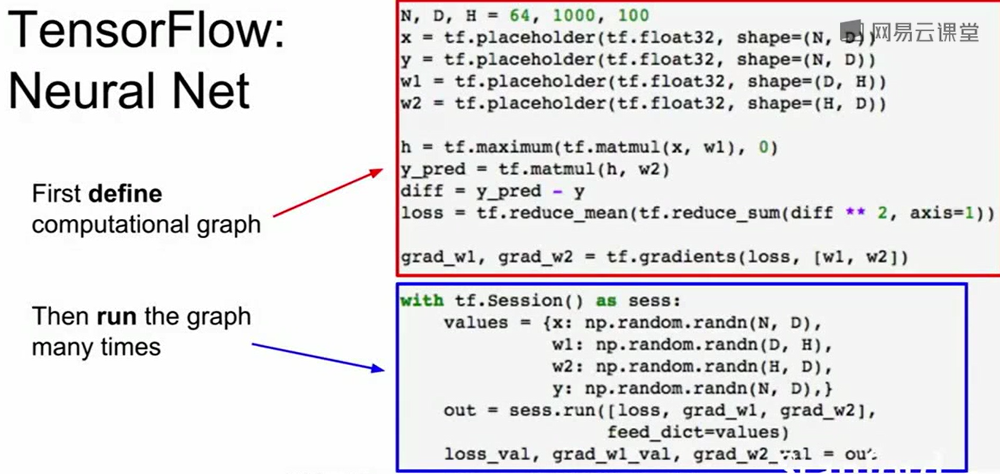

训练更新权值：

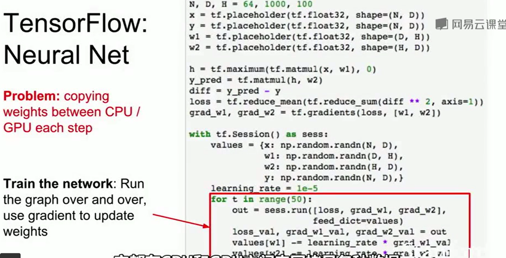

##### 问题：

因为在上个代码，每次计算都要讲weights传送到tensorflow的计算图中，numpy数组是存放在cpu内存中，也就是将data从cpu传输到gpu内存中

因为CPU与GPU之间的bottleneck，如果网络非常大，权值与梯度值非常多，这样是非常耗费资源的。每个时钟周期都要这样复制。

##### Tensorflow的解决方案：

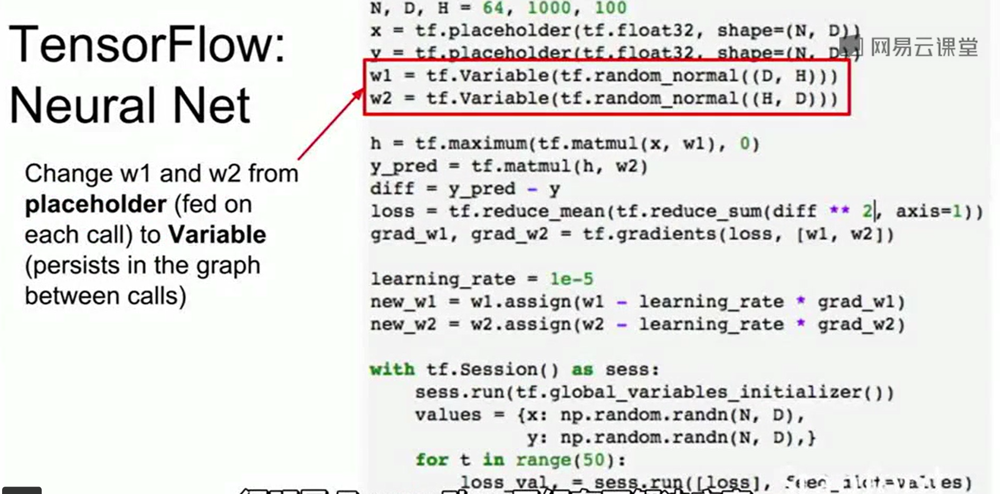

tf.variable()相当于占位符，而且可以tf.global_variables_initializer()来初始化，这些都是交付由tensorflow来完成，而不是之前的numpy。

显然上面的实现有一个bug，因为没有告诉tensorflow更新权值的操作：

这里tensorflow计算updates，返回的是None,是tensorflow第一个trick

##### 最终版：
使用tensorflow框架的optimizer来优化（L1 损失）：

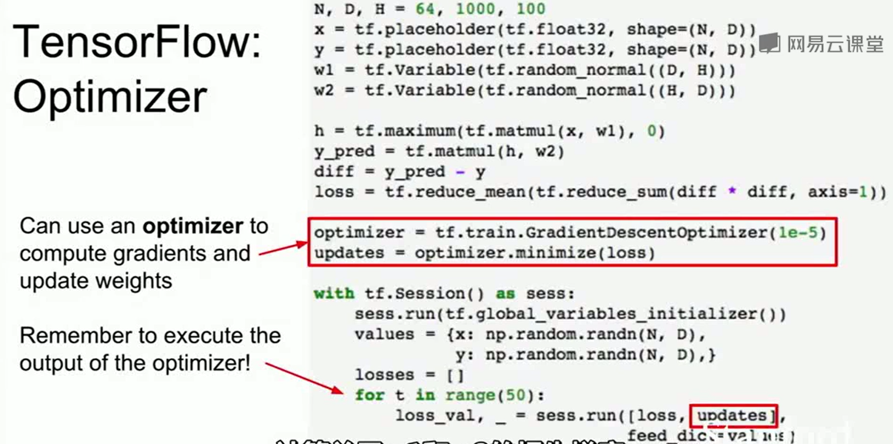

使用tensorflow框架的optimizer来优化（L2 损失）：

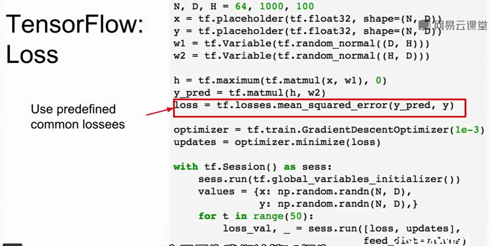

##### 但是这样实现有很多细节没有实现，例如:biases，而且如果实现很多网络层，会比较麻烦

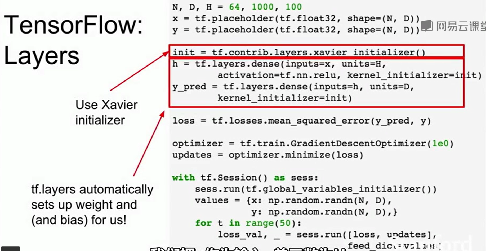

tf.layers这样的函数自动设置了weight, bias

## keras API

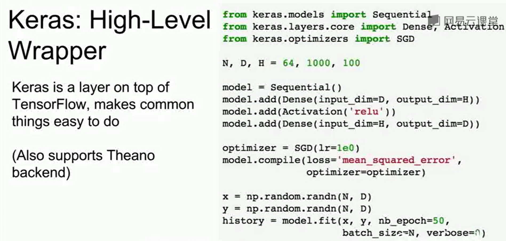
## Wrappers:
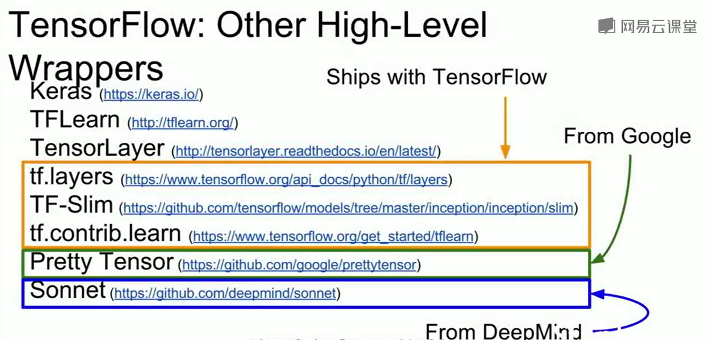
