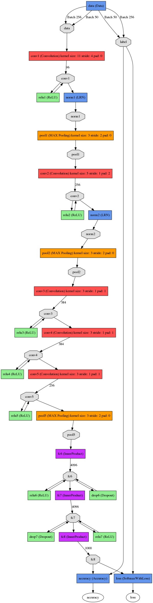

# Alexnet
## Alexnet结构

## Alexnet简介
alexnet总共包括8层，其中前5层convolutional，后面3层是full-connected，文章里面说的是减少任何一个卷积结果会变得很差，下面我来具体讲讲每一层的构成：

### 第一层
输入图像为227\*227\*3(paper上貌似有点问题224\*224\*3)的图像

使用了96个kernels（96,11,11,3)

卷积核进行对原始图像的每次卷积都生成一个新的像素。

卷积核沿原始图像的x轴方向和y轴方向两个方向移动，移动的步长是4个像素。

因此，卷积核在移动的过程中会生成 (227-11)/4+1=55 个像素(227个像素减去11，正好是54，即生成54个像素，再加上被减去的11也对应生成一个像素)，行和列的55\*55个像素形成对原始图像卷积之后的像素层。

共有96个卷积核，会生成55\*55\*96个卷积后的像素层。

96个卷积核分成2组，每组48个卷积核。对应生成2组55\*55\*48的卷积后的像素层数据。

这些像素层经过relu1单元的处理，生成激活像素层，尺寸仍为2组55\*55\*48的像素层数据。

经过response-normalized层（其实是Local Response Normalized，后面会讲下这里）正则化。

这些像素层经过pool运算(池化运算)的处理，池化运算的尺度为3*3，运算的步长为2，则池化后图像的尺寸为(55-3)/2+1=27。 即池化后像素的规模为27*27*96，pool这一层好像caffe里面的alexnet和paper里面不太一样，alexnet里面采样了两个GPU，所以从图上面看第一层卷积层厚度有两部分，池化pool_size=(3,3),滑动步长为2个pixels，得到96个27\*27个feature。

第一卷积层运算结束后形成的像素层的规模为27*27*96。分别对应96个卷积核所运算形成。这96层像素层分为2组，每组48个像素层，每组在一个独立的GPU上进行运算。

### 第二层
第二层输入数据为第一层输出的27\*27\*96的像素层，为便于后续处理，每幅像素层的左右两边和上下两边都要填充2个像素；

27\*27\*96的像素数据分成27\*27\*48的两组像素数据，两组数据分别再两个不同的GPU中进行运算。

每组像素数据被5\*5\*48的卷积核进行卷积运算，卷积核对每组数据的每次卷积都生成一个新的像素。

卷积核沿原始图像的x轴方向和y轴方向两个方向移动，移动的步长是1个像素。

因此，卷积核在移动的过程中会生成(27-5+2\*2)/1+1=27个像素。(27个像素减去5，正好是22，在加上上下、左右各填充的2个像素，即生成26个像素，再加上被减去的5也对应生成一个像素)，行和列的27\*27个像素形成对原始图像卷积之后的像素层。

共有256个5\*5\*48卷积核；这256

卷积核对每组数据的每次卷积都生成一个新的像素。卷积核沿像素层数据的x轴方向和y轴方向两个方向移动，移动的步长是1个像素。

因此，运算后的卷积核的尺寸为(13-3+1\*2)/1+1=13（13个像素减去3，正好是10，在加上上下、左右各填充的1个像素，即生成12个像素，再加上被减去的3也对应生成一个像素），每个GPU中共13\*13\*192个卷积核。

2个GPU中共13\*13\*384个卷积后的像素层。这些像素层经过relu4单元的处理，生成激活像素层，尺寸仍为2组13\*13\*192像素层，共13\*13\*384个像素层。

### 第五层
第五层输入数据为第四层输出的2组13\*13\*192的像素层；

为便于后续处理，每幅像素层的左右两边和上下两边都要填充1个像素；

2组像素层数据都被送至2个不同的GPU中进行运算。

每个GPU中都有128个卷积核，每个卷积核的尺寸是3\*3\*192。

因此，每个GPU中的卷积核能对1组13\*13\*192的像素层的数据进行卷积运算。

卷积核对每组数据的每次卷积都生成一个新的像素。卷积核沿像素层数据的x轴方向和y轴方向两个方向移动，移动的步长是1个像素。

因此，运算后的卷积核的尺寸为(13-3+1\*2)/1+1=13（13个像素减去3，正好是10，在加上上下、左右各填充的1个像素，即生成12个像素，再加上被减去的3也对应生成一个像素），每个GPU中共13\*13\*128个卷积核。

2个GPU中共13\*13\*256个卷积后的像素层。这些像素层经过relu5单元的处理，生成激活像素层，尺寸仍为2组13\*13\*128像素层，共13\*13\*256个像素层。

2组13\*13\*128像素层分别在2个不同GPU中进行池化(pool)运算处理。池化运算的尺度为3\*3，运算的步长为2，则池化后图像的尺寸为(13-3)/2+1=6。 即池化后像素的规模为两组6\*6\*128的像素层数据，共6\*6\*256规模的像素层数据。

全连接层： 前两层分别有4096个神经元，最后输出softmax为1000个（ImageNet），注意caffe图中全连接层中有relu、dropout、innerProduct。
### 第六层

第六层输入数据的尺寸是6\*6\*256，采用6\*6\*256尺寸的滤波器对第六层的输入数据进行卷积运算；

每个6*6*256尺寸的滤波器对第六层的输入数据进行卷积运算生成一个运算结果，通过一个神经元输出这个运算结果；

共有4096个6\*6\*256尺寸的滤波器对输入数据进行卷积运算，通过4096个神经元输出运算结果；这4096个运算结果通过relu激活函数生成4096个值；并通过drop运算后输出4096个本层的输出结果值。

由于第六层的运算过程中，采用的滤波器的尺寸(6\*6\*256)与待处理的feature map的尺寸(6\*6\*256)相同，即滤波器中的每个系数只与feature map中的一个像素值相乘；而其它卷积层中，每个滤波器的系数都会与多个feature map中像素值相乘；因此，将第六层称为全连接层。

第五层输出的6\*6\*256规模的像素层数据与第六层的4096个神经元进行全连接，然后经由relu6进行处理后生成4096个数据，再经过dropout6处理后输出4096个数据。

### 第七层

第六层输出的4096个数据与第七层的4096个神经元进行全连接，然后经由relu7进行处理后生成4096个数据，再经过dropout7处理后输出4096个数据。

### 第八层

第七层输出的4096个数据与第八层的1000个神经元进行全连接，经过训练后输出被训练的数值。

