# FaceNet: A Unified Embedding for Face Recognition and Clustering论文笔记

CVPR 2015

来自谷歌的一篇文章，这篇文章主要讲述的是一个利用深度学习来进行人脸验证的方法，目前在LFW上面取得了最好的成绩，识别率为99.63%（LFW最近数据刷的好猛）。

传统的基于CNN的人脸识别方法为：利用CNN的siamese网络来提取人脸特征，然后利用SVM等方法进行分类。

而这篇文章中他们提出了一个方法系统叫作FaceNet，它直接学习图像到欧式空间上点的映射，其中呢，两张图像所对应的特征的欧式空间上的点的距离直接对应着两个图像是否相似。

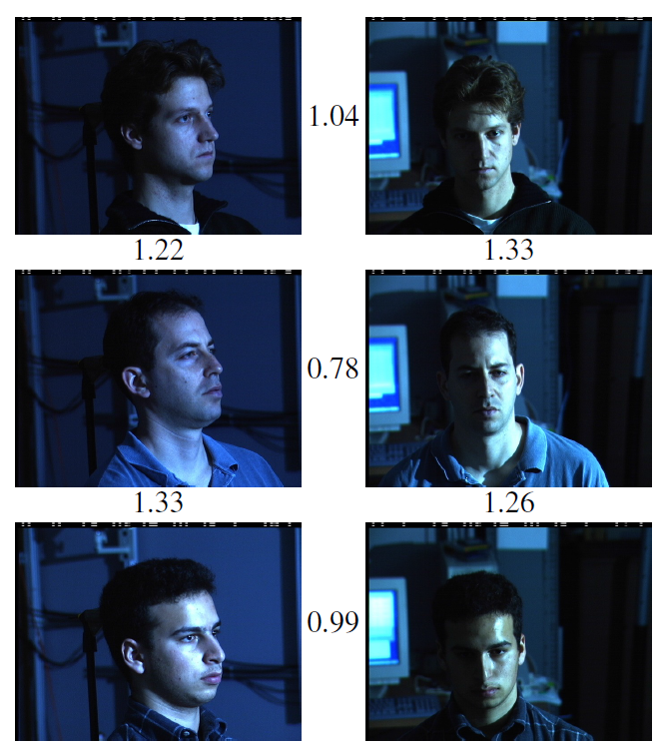

这是一个简单的示例，其中图中的数字表示这图像特征之间的欧式距离，可以看到，图像的类内距离明显的小于类间距离，阈值大约为1.1左右。

这篇文章中，最大的创新点应该是提出不同的损失函数，直接是优化特征本身，用特征空间上的点的距离来表示两张图像是否是同一类。

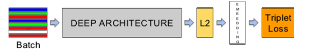

上图是文章中所采用的网络结构，其中可以看出，其中，前面部分跟CNN是相同的，只是后面接一个特征归一化（使其特征的||f(x)||2=1,这样子，所有图像的特征都会被映射到一个超球面上)，接着再去优化这些特征，而文章这里提出了一个新的损失函数(优化函数），而这也是文章最大的特点所在。

## Triplet loss
什么是Triplet Loss呢？故名思意，也就是有三张图片输入的Loss（之前的都是Double Loss或者 是 SingleLoss），文章这里，直接学习特征间的可分性：相同身份之间的特征距离要尽可能的小，而不同身份之间的特征距离要尽可能的大（LDA思想）。

损失函数设计目标： Here we want to ensure that an image(anchor) of a specific person is closer to all other images(positive) of the same person than it is to any image(negative) of any other person.

** 也就是使相同类图片的度量距离小于所有互不同类图片的度量距离 **

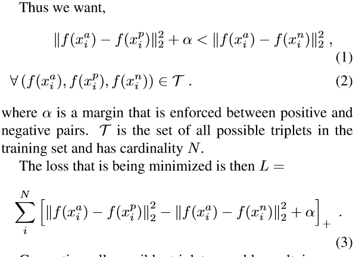

a: anchor

p: positive

n: nagative

转换一下，它的损失函数就变为上式所示：即 最小化 （类内距离-类间距离+边际），其中，边际\alpha是一个常量。

在上面中，如果严格的按照上式来进行学习的话，它的T（穷举所有的图像3元组）是非常大的。
举个例子：在一个1000个人，每人有20张图片的情况下，其T=1000*20*20*999
也就是O(T)=N2 ，所以，穷举是不大现实的。
那么，我们只能从这所有的N2个中选择部分来进行训练.

现在问题来了，怎么从这么多的图像中挑选呢？
答案是选择最难区分的图像对。

## Triplet selection
给定一张人脸图片，我们要挑选其中的一张hard positive：即另外19张图像中，跟它最不相似的图片。

同时选择一张hard negative：即在20*999图像中，跟它最为相似的图片。

挑选hard positive 和 hard negative有两种方法，offline和online方法，具体的差别只是在训练上。

实际采用：采用在线的方式，在mini-batch中挑选所有的anchor positive 图像对，同时，依然选择最为困难的anchor negative图像对。

新的问题：选择最为困难的负样本，在实际当中，容易导致在训练中很快地陷入局部最优，或者说整个学习崩溃f(x)=0//我在CNN学习的时候也经常会遇到这个问题，不过我的是f(x)=1

为了避免这个问题，在选择negative的时候，使其满足上式(3)：左边：Positive pair的欧式距离右边：negative pair的欧式距离。

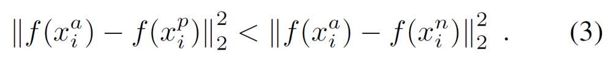

把这一个约束叫作semi-hard

## 网络结构

文章中的CNN采用了两种结构（都是直接采用别人的方法）

第一个网络结构是利用特征可视化的那篇文章

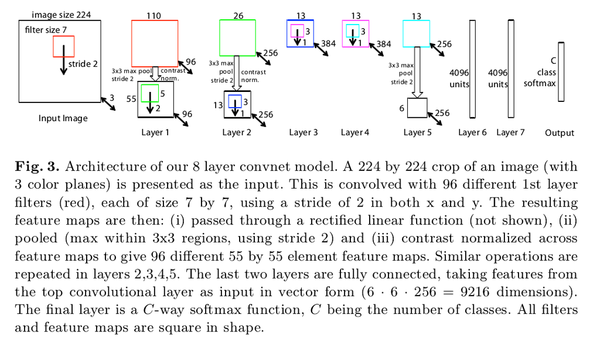

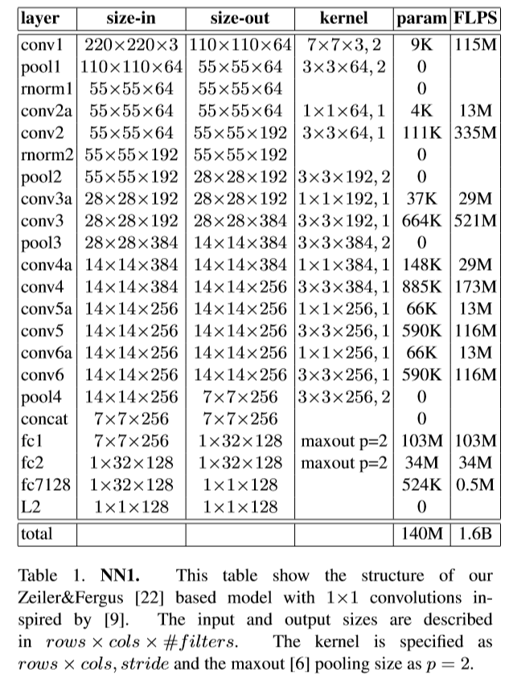

第二个网络采用的网络结构是GoLeNet，层数更多，参数更少

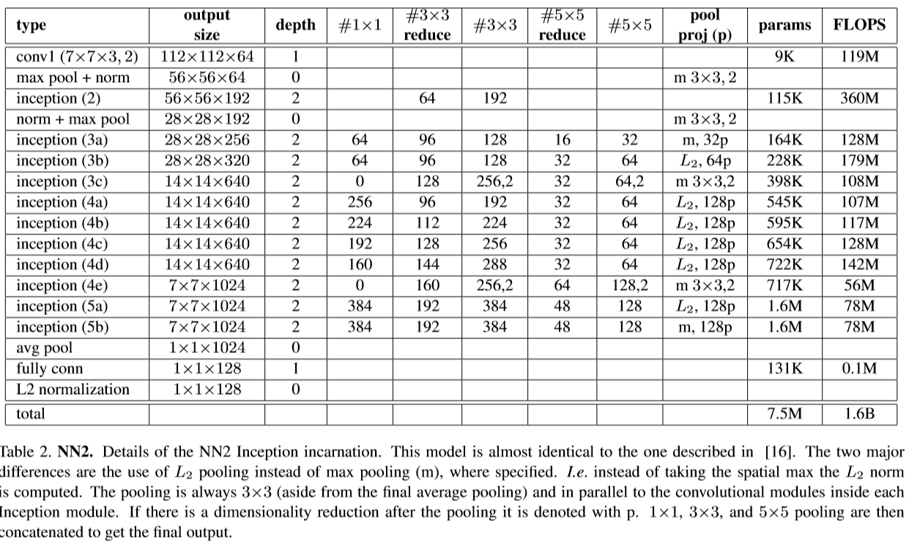

### 论文的实验：

1. 不同的网络配置下的识别率。

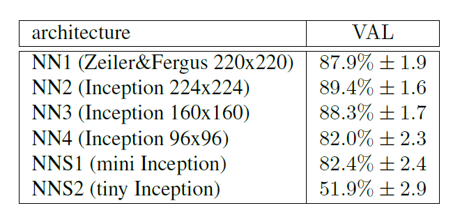

2. 不同的训练图像数据集的大小。

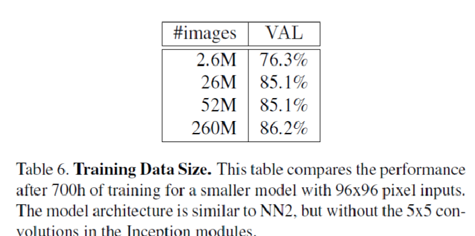

3. 不同的特征维度下的识别率：

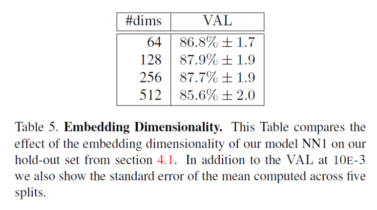

4. 不同的图像质量下的识别率：

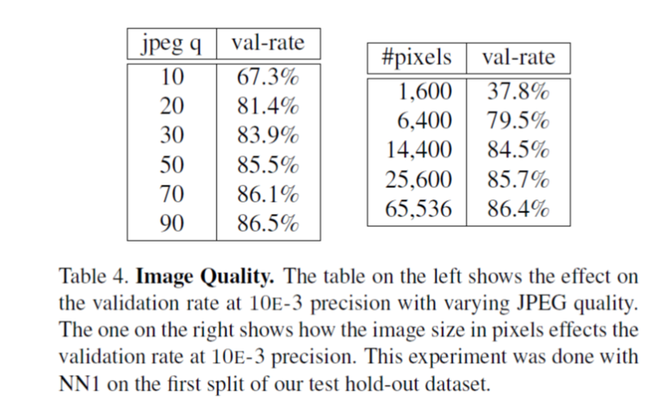

文章的贡献

1，新的loss函数

2，特征维度可以很稀疏128维

https://blog.csdn.net/qq_30478885/article/details/78976049
