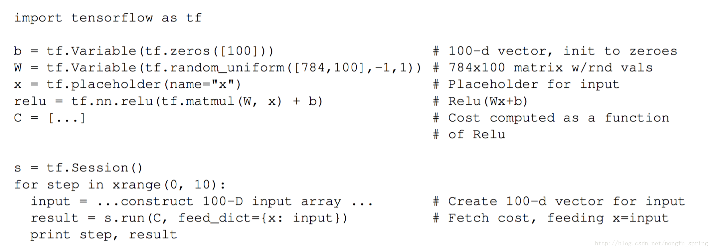
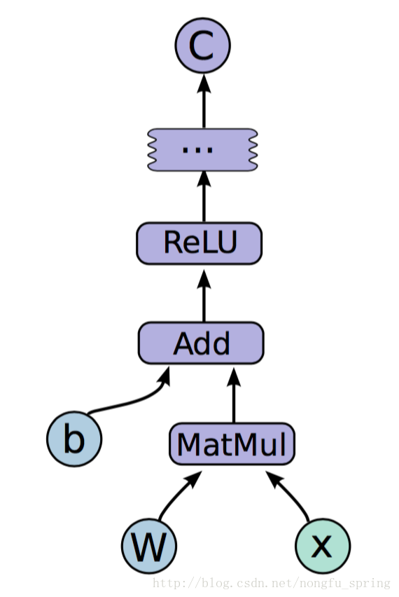

# tensorflow运行
## tf.placeholder函数
***tf.placeholder(dtype, shape=None, name=None)***

placeholder，占位符，在tensorflow中类似于函数参数，运行时必须传入值。
```
    dtype：数据类型。常用的是tf.float32,tf.float64等数值类型。
    shape：数据形状。默认是None，就是一维值，也可以是多维，比如[2,3], [None, 3]表示列是3，行不定。
    name：名称。
```
一般与sess.run， feed_dict搭配使用
## sess.run函数
这里 self.sess.run(）函数是执行一个会话，第一个参数是图的输出节点，第二个参数图的输入节点。

示例：
```python
self.sess.run([d_optim, self.d_sum], feed_dict={ self.images: batch_images, self.z: batch_z })，
```

上面的会话会根据输出节点d_optim, self.d_sum在图中找到最初的输入节点。

d_optim———>d_loss——->D_logits, D_logits_。

其中D_logits的输入是self.images， D_logits_的输入是self.z。因此这里run的第二个参数应该为{self.images，self.z}。

但是self.images，self.z只是个用placeholder定义的占位符，因此需要指定实际的输入。所以，这里用feed_dict指定了个字典，key值为self.images的占位符对应的值为batch_images，即加载的真实图片数据。key值为self.z的占位符对应的值为batch_z，即噪音数据。

这里看一下self.images，self.z的定义，均是用placeholder生成的占位符。
```python
self.images = tf.placeholder(tf.float32, [self.batch_size] + [self.output_size, self.output_size, self.c_dim],
                                name='real_images')

self.z = tf.placeholder(tf.float32, [None, self.z_dim],name='z') 
```
## 介绍tensorflow

张量(Tensor)

名字就是TensorFlow，直观来看，就是张量的流动。张量(tensor)，即任意维度的数据，一维、二维、三维、四维等数据统称为张量。而张量的流动则是指保持计算节点不变，让数据进行流动。

这样的设计是针对连接式的机器学习算法，比如逻辑斯底回归，神经网络等。连接式的机器学习算法可以把算法表达成一张图，张量在图中从前到后走一遍就完成了前向运算；而残差从后往前走一遍，就完成了后向传播。

算子(operation)

在TF的实现中，机器学习算法被表达成图，图中的节点是算子(operation)，节点会有0到多个输出，下图是TF实现的一些算子。

每个算子都会有属性，所有的属性都在建立图的时候被确定下来，比如，最常用的属性是为了支持多态，比如加法算子既能支持float32，又能支持int32计算。

边(edge)

TF的图中的边分为两种：

正常边，正常边上可以流动数据，即正常边就是tensor

特殊边，又称作控制依赖，(control dependencies)

    没有数据从特殊边上流动，但是特殊边却可以控制节点之间的依赖关系，在特殊边的起始节点完成运算之前，特殊边的结束节点不会被执行。
    也不仅仅非得有依赖关系才可以用特殊边，还可以有其他用法，比如为了控制内存的时候，可以让两个实际上并没有前后依赖关系的运算分开执行。
    特殊边可以在client端被直接使用

会话(Session)

客户端使用会话来和TF系统交互，一般的模式是，建立会话，此时会生成一张空图；在会话中添加节点和边，形成一张图，然后执行。

下图有一个TF的会话样例和所对应的图示。
 
 

https://blog.csdn.net/cc1949/article/details/78364615?locationNum=4&fps=1

https://blog.csdn.net/nongfu_spring/article/details/54347996
